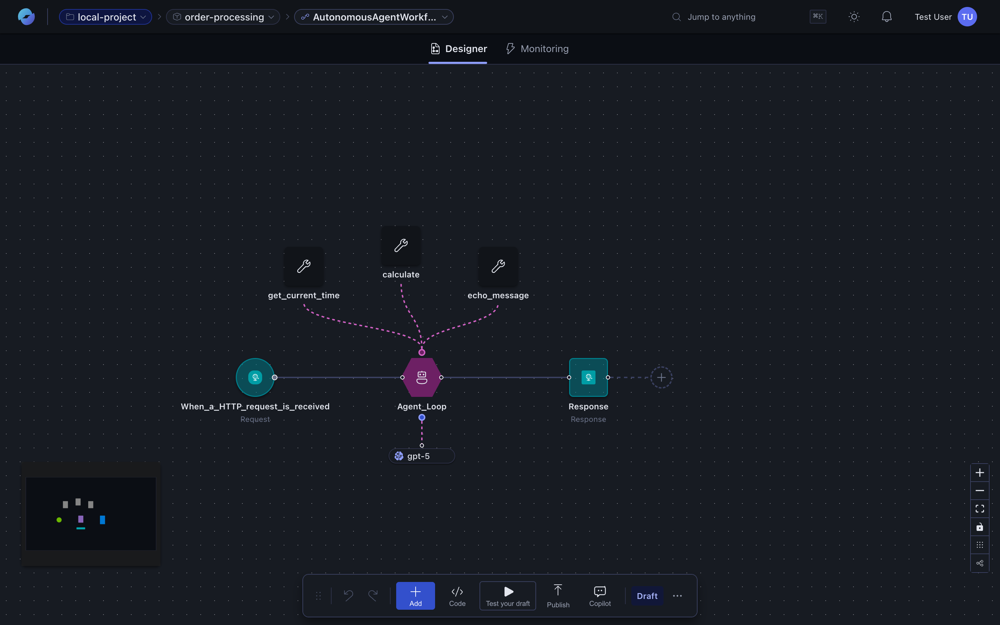
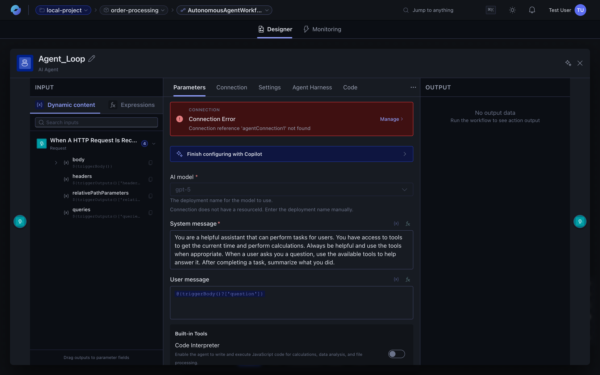
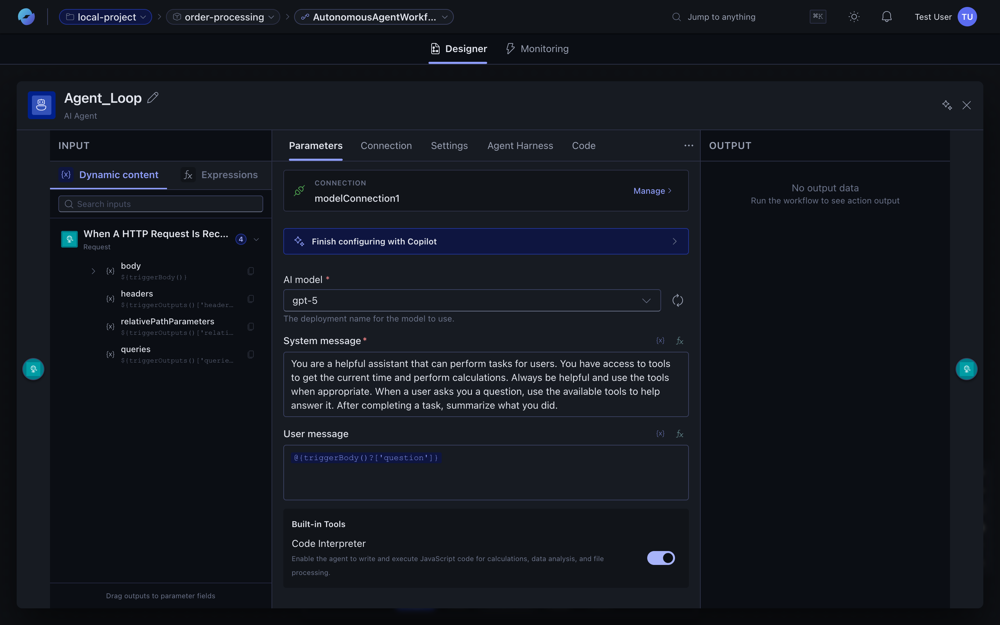

An **agent** is a workflow action backed by a model. Drop it onto the canvas like any other action; give it a system prompt, a toolset, and an input; downstream actions consume its output.



:::tip[Running code from an agent]
For agents that need to execute code in an isolated environment (run scripts, browse a filesystem, use cloned repos), see **[Sandboxes](/features/sandboxes/)**.
:::

## Anatomy of an agent

The agent node has a five-tab panel: **Parameters**, **Connection**, **Settings**, **Agent Harness**, and **Knowledge**. Together they configure everything below.



| Field | Where it lives | What it is |
| --- | --- | --- |
| **Agent kind** | Parameters tab → AI model dropdown | Native (platform-driven loop) or Foundry (Azure AI Foundry Agent Service). See *Native vs Foundry* below. |
| **AI model** | Parameters tab → AI model | The model deployment to call (e.g. `gpt-4`, `gpt-5`). For Foundry agents, this is the Foundry assistant. |
| **Model connection** | Connection tab | The credential / endpoint used to reach the model. Pick an existing connection or click *Create new AI model*. |
| **System message** | Parameters tab → System message | The agent's role and constraints. Supports the full expression language. |
| **User message** | Parameters tab → User message | The agent's input on each invocation. Usually an expression that pulls from the trigger body or a previous action. |
| **Toolset** | Sub-actions inside the agent loop on the canvas + **Built-in Tools** toggle on Parameters | What the agent may call. See *Adding tools to an agent* below. |
| **Knowledge sources** | Knowledge tab | Optional grounding documents / indexes the agent can retrieve from at runtime. See [Knowledge bases](/features/knowledge-bases/). |
| **Iteration bounds** | Settings tab | Max tool-call iterations so a runaway loop can't burn through cost. |
| **Sandbox / Agent Harness** | Agent Harness tab | Isolated compute the agent runs code in. See [Sandboxes](/features/sandboxes/). |

## Native vs Foundry agents

Two flavours of agent are supported and selected per-action:

| | **Native agent** | **Foundry agent** |
| --- | --- | --- |
| Runtime | The platform's built-in agent loop drives every iteration | Hands off to Azure AI Foundry Agent Service |
| Tools the model can call | Your custom action tools (sub-actions on the canvas) + the built-in **Code Interpreter** toggle | Foundry-managed tools (Foundry's Code Interpreter, File Search, function calling) and Foundry-side resources |
| Where the loop runs | In the workflow runtime; each iteration shows up as actions in the execution log | Inside Foundry; the platform sees a single agent call with the final output |
| Connections used | Your model deployment via a workflow connection | Your Foundry project's connection |
| When to pick it | You want tight integration with workflow connectors and per-iteration visibility in the run history | You've already built an Assistant in Foundry, or want Foundry-managed file search / built-in tool stack |

The choice is set in the Parameters tab's AI model dropdown. Switching between them is just a config change — the rest of the workflow doesn't care.

## The agent loop

When a **native** agent action executes, the runtime:

1. Sends the system prompt + input to the model.
2. If the model picks a tool, the runtime invokes it and feeds the result back.
3. Repeats until the model produces a final answer or the loop hits its bound.
4. Returns the final answer plus structured outputs to the rest of the workflow.

Each iteration is its own entry in the [run history](/features/runs-and-monitoring/) — you can see the model's tool-call decision, the tool's inputs and outputs, and how long each step took.

Downstream actions can read the agent's outputs with the expression language:

```
@outputs('AgentName')['lastAssistantMessage']
@outputs('AgentName')['structuredOutput']?['someField']
```

### Agent parameters — feeding values into tools

When the model calls one of the agent's custom tools, it provides arguments based on the tool's parameter schema. Inside a tool's action you read those arguments with the **`agentParameters(...)`** expression function:

```
@agentParameters('orderId')         // value the agent passed for the orderId param
@agentParameters('limit')
```

This is the bridge between what the model decided to send and the workflow logic that runs the tool. The function name is camelCase — `agentParameters(...)` — in both the standard expression language and inline JavaScript actions. (A legacy lowercase form, `@agentparameters(...)`, also works in the standard language for backward compatibility.)

### Chat log in monitoring

When you open a run that includes an agent, the **bottom panel** in the monitoring view has a **Chat** tab that shows the full conversation: every user message, every tool call the model made (with arguments), every tool result the runtime fed back, and the model's final answer. That same data is also available structurally in the agent action's outputs, but the chat view is the fastest way to debug "why did the agent do that?".

## Adding tools to an agent

Tools come in two flavours.

### Built-in tools (toggle in the agent's Parameters tab)

The agent node's **Parameters** tab exposes platform-provided tools you can turn on with a switch — currently **Code Interpreter** (see below). For agents that need a richer execution environment (cloned repos, custom skills, more languages), turn on a **sandbox** in the **Agent Harness** tab — see [Sandboxes](/features/sandboxes/).



#### Code Interpreter

The **Code Interpreter** built-in tool lets the model write and execute **JavaScript** at runtime inside an isolated Node.js sandbox. It's the right choice when the agent needs to:

- Crunch numbers, run algorithms, or transform data structures the model can't reliably do by hand.
- Parse, filter, or reshape JSON / arrays returned from other tools.
- Generate dynamic content (regex extraction, templating, formatting).

The agent loop with Code Interpreter looks like:

1. The model decides it needs to compute something, emits a tool call with a `code` argument.
2. The runtime executes the JavaScript in an isolated process.
3. The output flows back into the chat history as a tool result.
4. The model reads the result and either continues with another tool or produces a final answer.

**Turning it on.** Open the agent's **Parameters** tab and flip the **Code Interpreter** switch under *Built-in Tools*. That's it — no separate connection or sandbox required for built-in execution.

**Mixing with custom tools.** Code Interpreter composes with custom action tools (see below). A common pattern: query a database action → transform the rows with Code Interpreter → call an HTTP tool to post the result.

| Real-world flow | Tool sequence |
| --- | --- |
| Daily report | `code_interpreter` (aggregate) → `Send_Email` |
| ETL | `Query_Database` → `code_interpreter` (transform) → `Insert_Records` |
| API submission | `code_interpreter` (validate) → `HTTP_Request` (submit) → `code_interpreter` (parse response) |

**Limitations of Code Interpreter:**

- **JavaScript only.** No Python, no other runtimes.
- **No network access.** The sandbox can't make HTTP calls — use an HTTP action tool for that.
- **No file system.** No reading or writing files; pass inputs through the agent's chat context.
- **Per-execution timeout.** Long-running snippets are cut off; favour many small calls over one big one.
- **Memory / CPU bounded.** The sandbox is sized for transformations, not heavy compute.

For anything that needs network, a real filesystem, or non-JS runtimes, use a **[sandbox](/features/sandboxes/)** instead of Code Interpreter.

### Custom tools (action nodes inside the agent loop)

Anything the model should be able to call goes on the canvas as a child action of the agent node — typically a connector action, an HTTP call, or a sub-workflow invocation. Each tool gets:

- A **name** the agent uses to reference it.
- A **description** the agent reads when deciding which tool to invoke.
- A **parameter schema** the agent fills with arguments at call time.


To add one: click **+** inside the agent boundary on the canvas, pick the action, and fill in its description. The agent's reasoning at runtime is only as good as those descriptions, so write them like docstrings: what the tool does, when to call it, and what each parameter means.

### Practical guidance

- Keep **toolsets small** (3–7 tools usually beats 20). Large toolsets confuse the model.
- Make tool **names verb-like** (`get_current_time`, `lookup_order`) — easier for the model to reason about.
- **Descriptions matter more than names.** Spend time on them.
- For long-running or expensive tools, set a **timeout** so a stuck tool doesn't burn through the agent's iteration budget.

## When to use an agent vs a deterministic workflow

| Use a deterministic workflow when… | Use an agent when… |
| --- | --- |
| The steps are known up front | The steps depend on the input |
| You need exact, repeatable behaviour | You're handling free-form text or messy inputs |
| Cost and latency matter most | Flexibility and reasoning matter more |

## Authoring tips

- Keep system prompts **specific** — agents follow good instructions, not vague aspirations.
- Give agents **few, sharp tools** — large toolsets confuse the model.
- Set **iteration bounds** that match expected difficulty.
- Use the agent's structured outputs rather than re-parsing its final message.
