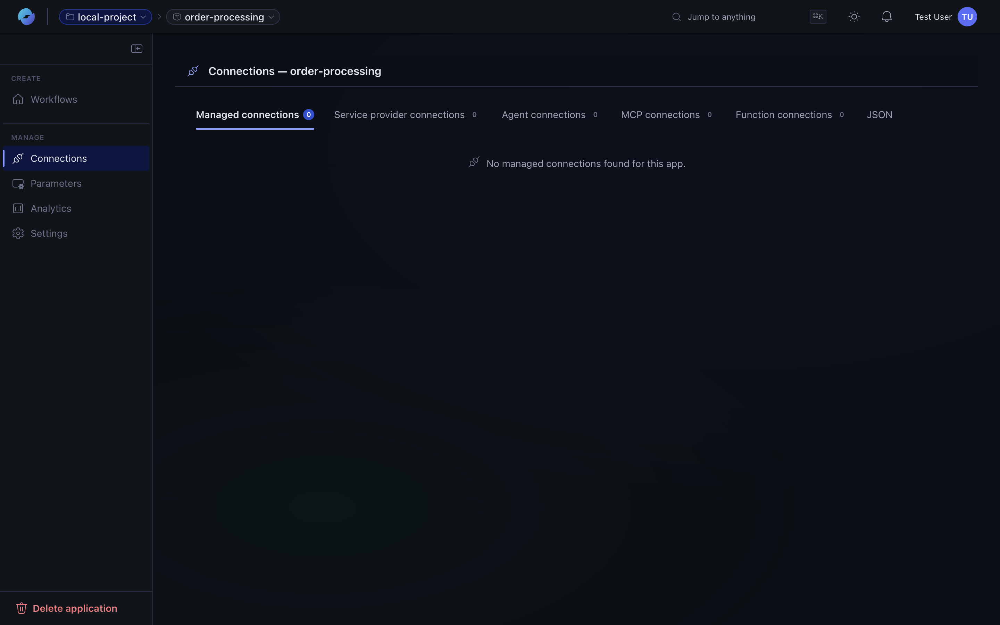

A **connector** is a typed integration with an external service. The catalog covers 1,400+ services — Azure, SaaS apps, databases, and HTTP APIs — so most workflows can be built without writing custom code.

Connections are scoped to an **application** and managed under its **Connections** tab. Each connection captures the auth setup once and is reusable across every workflow in the app.

## Built-in connectors

Built-in connectors run in-process with the runtime and require no external connection runtime:

- **HTTP / HTTPS** — make arbitrary REST calls.
- **Schedule / Recurrence** — time-based triggers.
- **Service Bus** — queue and topic triggers and actions.
- **Event Hubs** — event ingestion.
- **Azure Storage** — blob, queue, table.
- **Cosmos DB** — read and write items.
- **SQL** — query and command against Azure SQL or SQL Server.
- **File System** — read and write files on the host or a mounted share.
- **Inline JavaScript** — a JS action with IntelliSense for quick logic.

## Managed connectors

Managed (cloud-hosted) connectors expose authenticated APIs to popular SaaS — Teams, Outlook, SharePoint, OneDrive, Salesforce, Slack, GitHub, ServiceNow, and many more. They're configured via standard Logic-Apps-style connection objects.

## Creating a connection

1. Add a connector action to a workflow.
2. The designer prompts you to create or pick a connection.
3. Sign in with the relevant identity (managed identity, OAuth account, API key — depends on the connector).
4. The connection is reusable across workflows in the same application.

## HTTP for everything else

If a service isn't covered by a managed connector, the built-in **HTTP** action handles arbitrary REST and JSON APIs. Combine it with the **Parse JSON** built-in to feed strongly-typed outputs into downstream actions.
