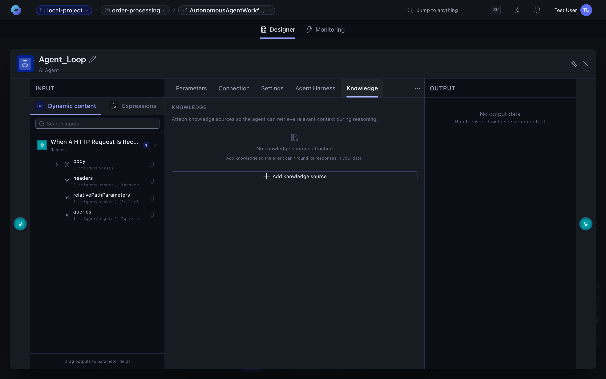

A **knowledge base** is an external source of context an [agent](/features/agents/) can search during its reasoning. Instead of relying only on what's baked into the model's training, the agent retrieves relevant passages from your docs, tickets, code, or data and uses them to ground its answer.

The Knowledge tab on the agent panel is the surface for attaching them.

## Supported source types

| Source | What it is | When to pick it |
| --- | --- | --- |
| **Azure AI Search** | An index you maintain in Azure AI Search (vector + keyword) | You already have a search index, or want fine control over chunking / scoring |
| **Foundry IQ** | A knowledge index hosted in Azure AI Foundry | You're already in the Foundry ecosystem and want managed retrieval |
| **Document Upload** | Documents you upload directly into the platform | You don't have an existing index; you want the platform to chunk + embed |
| **Work IQ** | Work IQ knowledge connector | Tenant-scoped knowledge surfaced through Microsoft 365 / Work IQ |

You can attach more than one source to the same agent — the runtime fans out the retrieval and merges the top results across sources.

## Attaching a source

1. Open the agent action and switch to the **Knowledge** tab.
2. Click **Add knowledge source**.
3. Pick the type (AI Search, Foundry IQ, Document Upload, or Work IQ).
4. Fill in the connection details — for AI Search you point at an index; for Foundry IQ you select a Foundry connection; for Document Upload you upload a file.
5. Save.

The next time the agent runs, retrieval happens before the model call: the agent's input + system prompt are used to query each attached source, the top passages are inlined into the model's context, and the model decides which (if any) to cite.

## How retrieval shows up in run history

Every retrieval is a step in the agent's iteration. In the [run detail](/features/runs-and-monitoring/), you'll see the retrieval as a separate entry under the agent action:

- **Inputs** — the query the runtime issued (often the user message rewritten by the model).
- **Outputs** — the passages retrieved, with a relevance score per result.

Use that view to debug "the agent answered from stale data" or "the agent didn't find the right snippet" — both usually trace back to chunking or query rewriting.

## Status — private preview

Knowledge bases are in **private preview** today. The tab appears in the portal when the feature is enabled for your project. Some things will tighten before public preview:

- Document Upload size / format limits.
- Per-source token-budget controls.
- Granular permissions on which workspace members can attach a source.

If you hit something rough, [report a bug](/support/report-a-bug/) — the feedback is shaping the GA shape.

## Where to go next

- **[Agents](/features/agents/)** — the rest of the agent surface (tools, sandboxes, parameters).
- **[Sandboxes](/features/sandboxes/)** — pair a knowledge base with a sandbox so the agent can both retrieve and execute code on the result.
- **[Runs and monitoring](/features/runs-and-monitoring/)** — read the retrieval inputs / outputs after a run.
