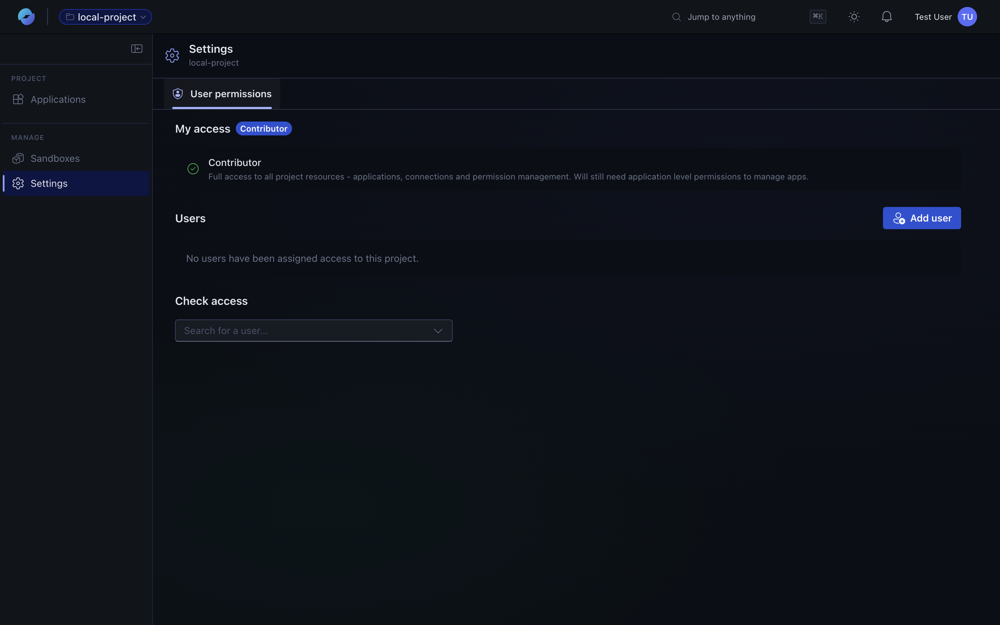
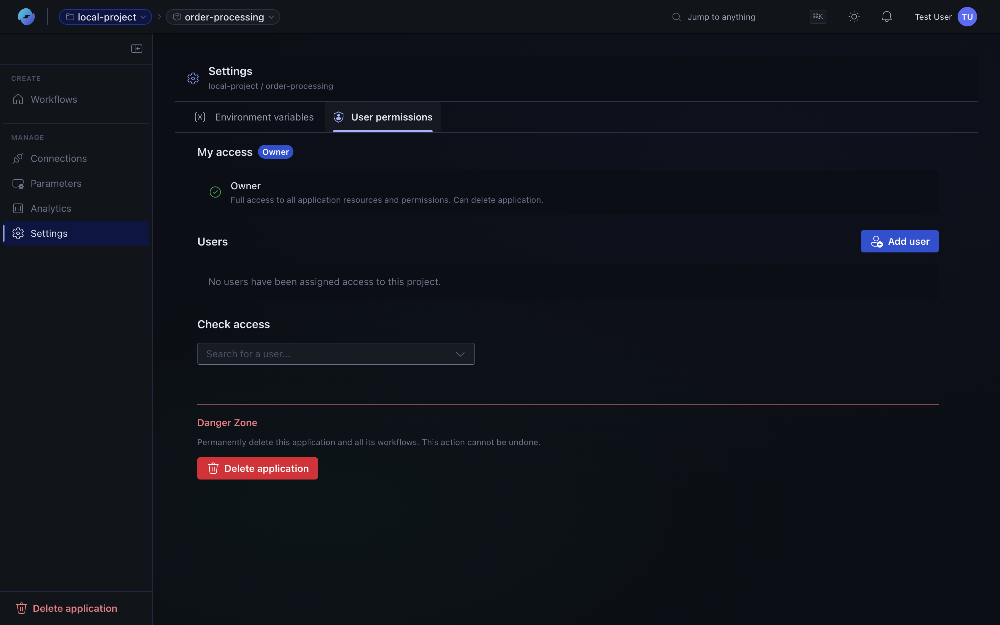
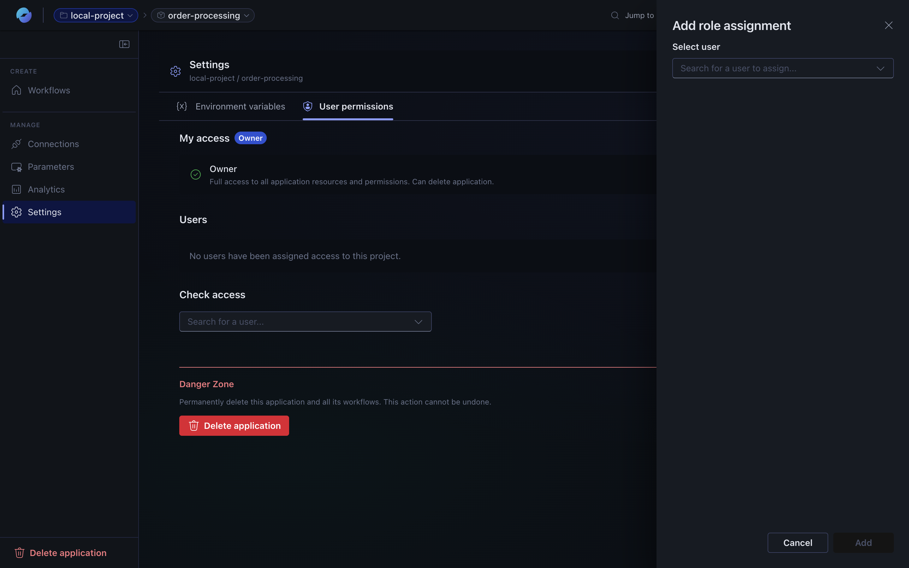

Access to the platform is controlled by a simple two-scope role model, plus a separate **owner** property on each resource. This page covers the model, the role matrix, and the most common sharing workflows.

## At a glance

- **Two independent scopes** — *Project* (organisational) and *Application* (content).
- **Three permission levels** — *Contributor* (admin), *Author* (creator), *Reader* (view-only).
- **Owner** is a resource property, not a permission level. The creator is the owner.
- **Apps are private by default** — invisible to other project members until you explicitly share them.
- **App-scope grant auto-adds project Reader** — so collaborators can reach the project resources the app depends on.

---

## Scopes and roles

The two scopes are evaluated independently. A user can have a role at the project scope, at the app scope, or both.

### Project-scope roles

| Role | Can do | Cannot do |
| --- | --- | --- |
| **Contributor** | Read + modify project settings · invite, update, remove members · create apps · list all apps (metadata only) · create / modify sandbox configurations | Delete the project (owner-only) · access app contents without app-scope permission |
| **Author** | Read project settings + member list · create new apps · create sandbox configurations · read sandbox configurations | Modify project settings · manage other users · see apps they weren't invited to · access app contents without app-scope permission |
| **Reader** | Read project settings + member list · read sandbox configurations | Create, modify, or delete anything · see any apps (they're private by default) |

### App-scope roles

:::note
*Author* is intentionally not available at app scope — only **Contributor** and **Reader**.
:::

| Role | Can do | Cannot do |
| --- | --- | --- |
| **Contributor** | Read + modify workflows, connections, parameters · view run history · trigger / cancel / resubmit runs · manage app permissions | Delete the app (owner-only) |
| **Reader** | Read workflows, connections, parameters · view run history | Create, modify, or delete anything · trigger or cancel runs |

### Cross-scope behaviour

- A **Project Contributor** sees app *metadata* (name, owner, dates) but **cannot** access app *contents* (workflows, connections).
- A **Project Owner** has an admin override on sub-resources — they can delete *any* app or sandbox in the project, even ones they don't own.
- When a user is granted app-scope permission, they **automatically receive project Reader** — enough to reach the project resources the app depends on.

---

## Owner

**Owner** is a property on the resource itself, set when the resource is created.

| Rule | Detail |
| --- | --- |
| Set on creation | The creator automatically becomes owner. |
| One owner per resource | Each project / app has exactly one. |
| Cannot be removed | The owner flag can't be cleared. |
| Orthogonal to roles | An owner typically has Contributor permission too, but they're separate concepts. |

### Owner-only actions

| Scope | Only the owner can |
| --- | --- |
| Project | Delete the project |
| App | Delete the app |

Even Contributors can't perform these actions.

---

## Privacy by default

When you create an app, it's **invisible** to everyone else in the project — only you (the owner) can see and access it. Project Contributors / Owners can see app metadata for governance but **not** the app's contents.

This matters because apps often contain automations connected to personal accounts (email, calendar, OneDrive). Privacy by default keeps that data private until you explicitly share it.

To share an app, the owner (or an app Contributor) explicitly invites users by granting them an app-scope role.

---

## Common tasks

### Create a project

1. Open the portal at **[otto.azure.com](https://otto.azure.com)**.
2. Click **Create project**, give it a name, pick a region.
3. Click **Create**.

You become the **Project Owner** automatically, receive **Contributor** permission at project scope, and can immediately add members, create apps, and create sandbox configurations.

### Invite someone to a project

1. Open the project → **Settings** → **User permissions** tab.
2. Click **Add user**.
3. Enter the email and pick a role.

| The user needs to… | Give them |
| --- | --- |
| Manage the project, invite others, see all app metadata | **Contributor** |
| Create new apps and shared resources | **Author** |
| Just view project settings and shared resources | **Reader** |

:::caution[They still won't see your apps]
Apps stay invisible. To grant access to a specific app, switch to that app's **Settings → User permissions** tab.
:::

### Create an app

1. Open the project.
2. Click **Create app**, name it, click **Create**.

You become the **App Owner**, receive **Contributor** permission at app scope, and the app is private to you by default.

### Share an app with a collaborator

1. Open the app → **Settings** → **User permissions** tab.
2. Click **Add user**.

3. Enter the user's email and pick a role (Contributor for full edit access, Reader for view-only).

#### What a Contributor can do

| Action | Allowed |
| --- | :---: |
| View workflows, connections, parameters | ✅ |
| Create / edit / delete workflows | ✅ |
| Create / edit connections | ✅ |
| View run history | ✅ |
| Trigger / cancel runs | ✅ |
| Manage app permissions | ✅ |
| **Delete the app** | ❌ (owner-only) |

The collaborator automatically receives project-level **Reader** so they can reach related project resources, and they'll see the app under their **Shared with you** view.

#### What a Reader can do

| Action | Allowed |
| --- | :---: |
| View workflows, connections, parameters | ✅ |
| View run history | ✅ |
| Create / edit / delete anything | ❌ |
| Trigger / cancel runs | ❌ |
| Manage permissions | ❌ |

Use Reader for demos, audits, or onboarding new team members without giving them edit access.

### Create shared resources (sandboxes)

1. Open the project → **Sandboxes**.
2. Click **New sandbox** (Author or higher at project scope is required).

| Role | Read | Create | Update | Delete |
| --- | :---: | :---: | :---: | :---: |
| Contributor | ✅ | ✅ | Only if you created it | Only if you created it |
| Author | ✅ | ✅ | Only if you created it | Only if you created it |
| Reader | ✅ | ❌ | ❌ | ❌ |
| Project Owner | ✅ | ✅ | Only if you created it | ✅ (any resource — admin override) |

**Only the creator can update a shared resource.** The Project Owner can delete any resource but can't edit ones they didn't create.

### Govern apps as a project admin

Project Owner / Contributor see every app in the project for governance purposes — name, owner, creation date, last modified — but **not** workflow contents, connections, or run history.

| Action | Project Owner | Project Contributor |
| --- | :---: | :---: |
| View app metadata | ✅ | ✅ |
| Read workflow content | ❌ | ❌ |
| Edit workflows | ❌ | ❌ |
| Access connections | ❌ | ❌ |
| Delete any app | ✅ | ❌ |

This is the deliberate privacy boundary: admins can manage resources without seeing personal data.

### Handle an orphaned app

When an app's owner leaves the organisation, the app becomes **orphaned**:

- Existing collaborators keep their access.
- No one but the **Project Owner** can delete it.
- It still shows up in the project's governance view.

If you're the Project Owner: open the project app list, find the orphaned app (the owner badge will show as departed/unknown), and either leave it for the collaborators or click **Delete**.

---

## Troubleshooting

| Problem | Cause | Fix |
| --- | --- | --- |
| "I can't see any apps in the project" | Apps are private by default. | Ask the app owner to add you at app scope, or get Contributor at project scope to see the governance view (metadata only). |
| "I can't create an app" | You have project Reader. | Ask a Contributor to upgrade you to Author or Contributor. |
| "I can't delete my shared resource" | Only the creator can delete a shared resource. | Ask the creator or a Project Owner (admin override). |
| "I can't delete an app" | Only the **App Owner** can delete an app. | Contact the App Owner. If they've left, the Project Owner can delete orphaned apps. |
| "I can't manage permissions on an app" | You need Contributor at app scope. | Ask an existing App Contributor or the App Owner to add or remove users. |
| "I can't trigger a workflow run" | You have app Reader. | Ask for Contributor at app scope, or have a Contributor trigger the run for you. |

---

## Summary

- **Two scopes** — project and app — evaluated independently (OR logic).
- **Three levels** at project scope, two at app scope. Author exists only at project scope.
- **Owner is a property**, not a level — enables owner-only actions like delete.
- **Apps are private by default**, even from project admins.
- **App-level permission auto-grants project Reader** so collaborators can reach related resources.
- **Project admins can govern apps** without ever seeing their contents.
