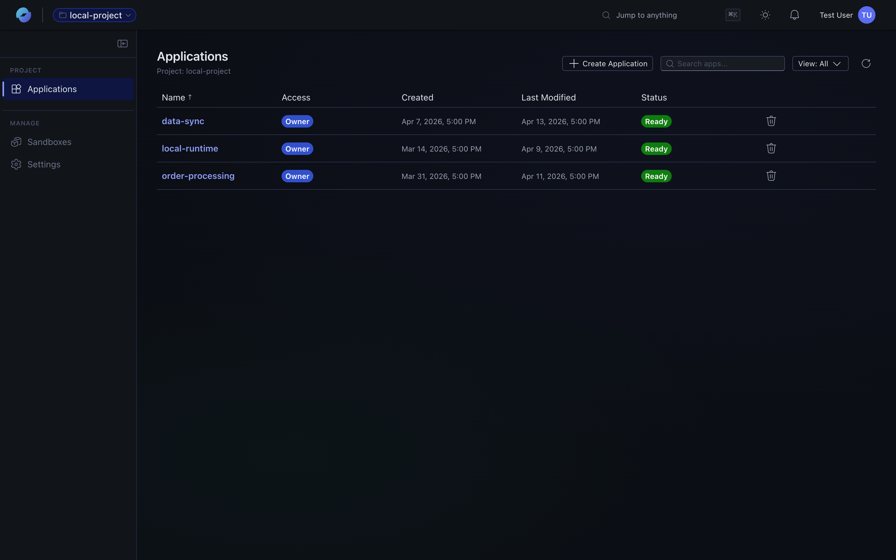
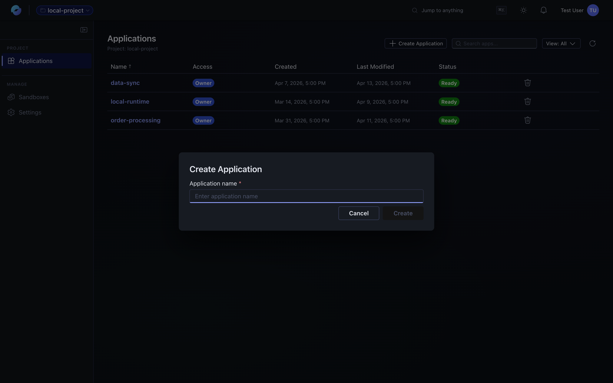
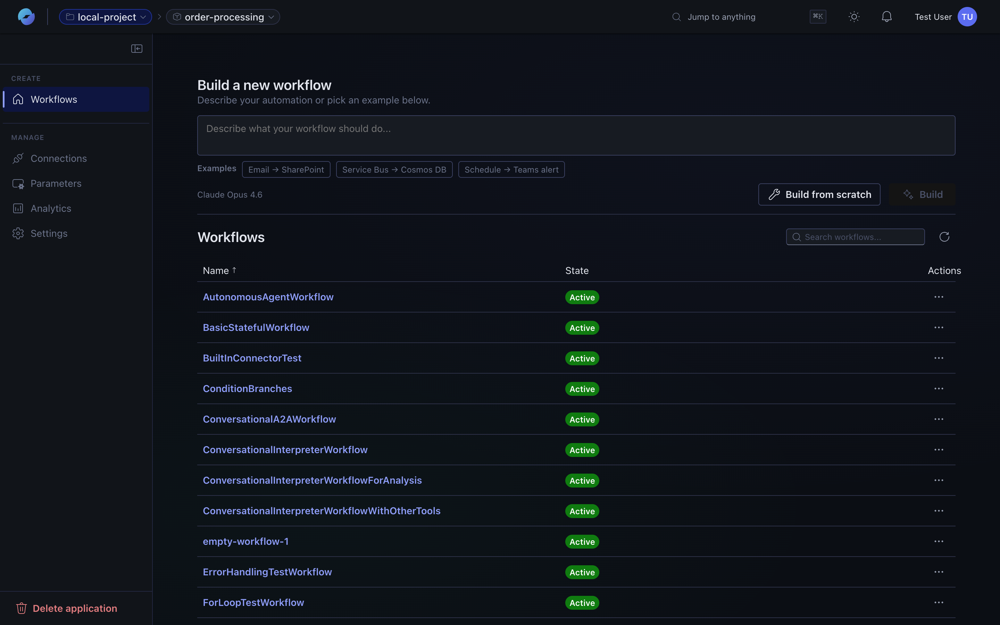

Your work is organised into a three-level hierarchy. Each level shows up in the portal's breadcrumb and left rail.

```
Environment ─┬─ Application ─┬─ Workflow ─┬─ Designer
             │               │            └─ Monitoring (runs)
             │               ├─ Connections
             │               ├─ Parameters
             │               ├─ Analytics
             │               └─ Settings (env vars, user permissions)
             ├─ Sandboxes (environment-scoped, see Sandboxes page)
             └─ Settings (user permissions)
```

## Environment

The top-level container. An **environment** holds applications, sandboxes, and environment-wide settings. It also defines who has access — RBAC is granted at the environment boundary.


When to create a new environment: when you want isolation (separate access control, separate quota, separate billing context) or a new business domain.

## Application

An application is a **deployable unit** inside an environment. It holds:

| Tab | What it's for |
| --- | --- |
| **Workflows** | The automations themselves — what this app actually does. |
| **Connections** | Reusable, authenticated bindings to external services (Teams, SharePoint, Service Bus, etc.). |
| **Parameters** | Named values referenced in workflows — environment-specific URLs, timeouts, feature flags. |
| **Analytics** | Run trends, success/failure rates, per-action latency. |
| **Settings** | App-level environment variables and user permissions. |


Most teams have a handful of apps per environment — one per logical service (e.g., `order-processing`, `notifications`, `daily-reports`).

### Creating an app

From the environment's **Applications** tab, click **Create Application** and give it a name.




Provisioning takes a minute or two — the **Status** column starts as *Building* and flips to **Ready** once the runtime is up. Don't open or wire up the app until it's Ready.

### Sharing an app

Apps are private to the creator by default. To invite collaborators, open the application's **Settings → User permissions** tab and add users by email — or grant environment-scope access for someone who should see every app. See **[Permissions](/features/permissions/)** for the full model.

## Workflow

The unit of automation. A workflow lives inside one app, has one trigger and a tree of actions, and is edited on the visual canvas or via the assistant. See [Workflows](/features/workflows/) for the full surface.



## Sandboxes (environment-scoped)

Sandboxes are isolated compute environments that workflow **agents** can run code in. They live at the environment level so multiple workflows across multiple apps can reuse the same pre-baked image. See **[Sandboxes](/features/sandboxes/)** for the full guide.

## Picking the right level for new work

| You're adding… | Put it at… |
| --- | --- |
| A new automation | A workflow inside an existing app |
| A new logical surface (different team, different SLOs, different connection set) | A new app inside the same environment |
| A separate access boundary or business domain | A new environment |
| A new code execution environment for agents (with cloned repos) | A new sandbox inside the environment |
