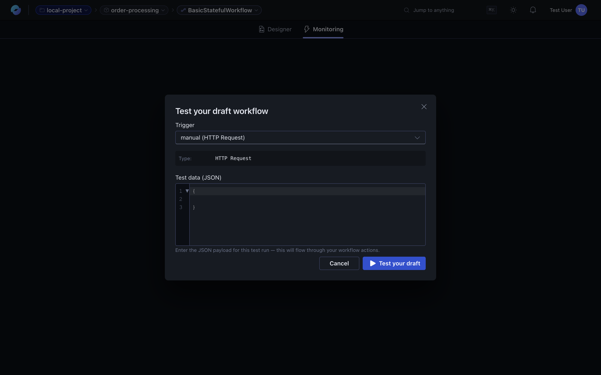
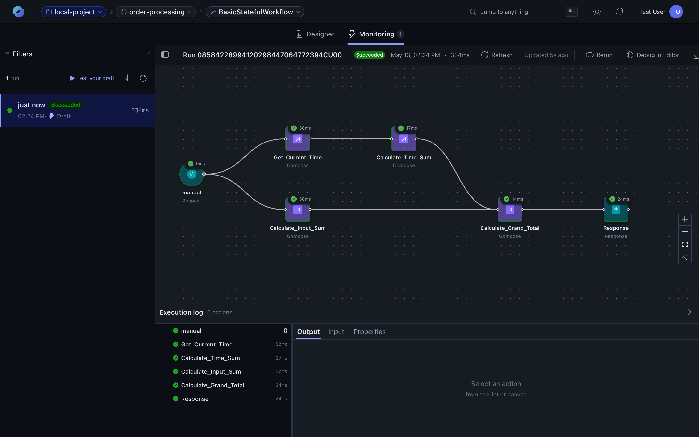
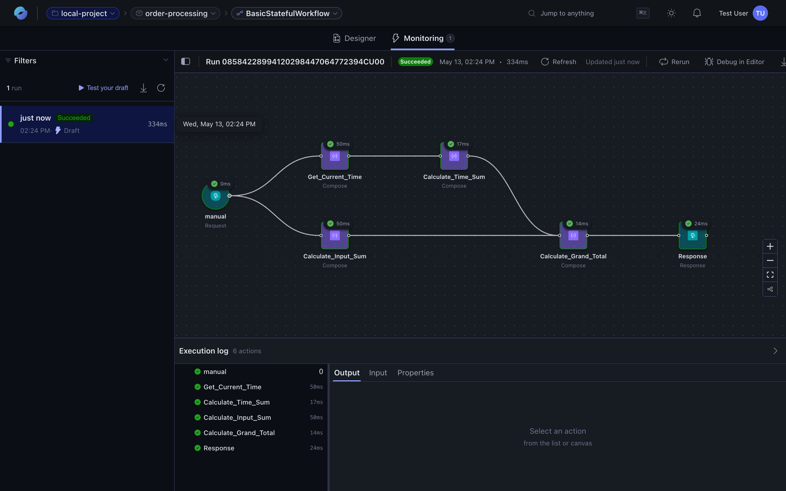
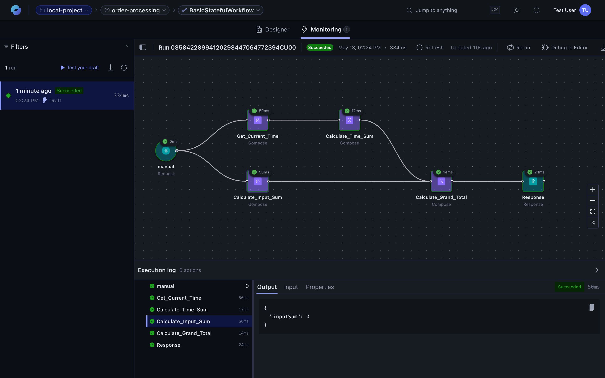
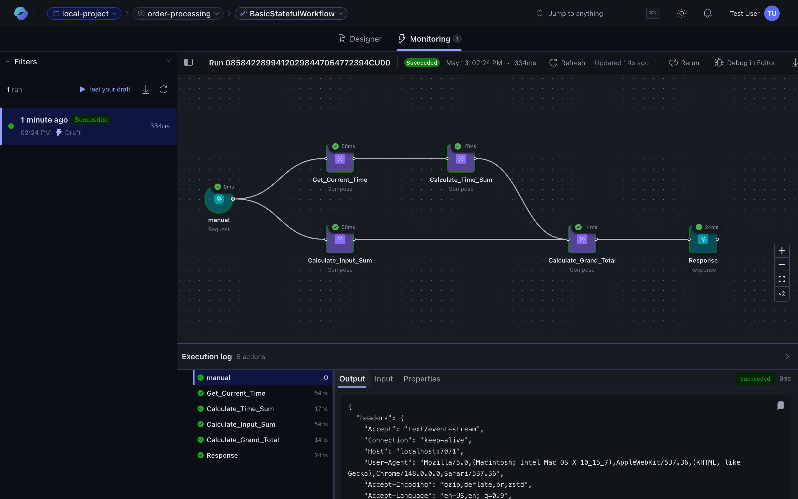
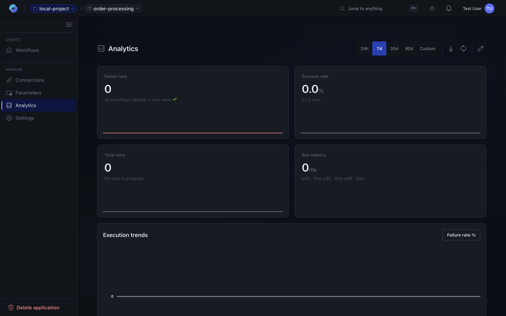

In Azure Logic Apps Automation, the [portal](https://auto.azure.com) records information about each workflow run. You can review each workflow operation along with the inputs, outputs, and duration.

## Triggering a run

For workflows with HTTP triggers (or any other manual-style trigger), the **Monitoring** tab's **Run workflow** button opens a test-run dialog. Pick the trigger, provide a JSON body, and submit.

For scheduled or event-driven workflows, runs appear automatically as the trigger fires.

## Real-time streaming

When you click **Test your draft** (or **Run workflow** on a draft), the monitoring view streams the run live — actions colour in as they start, complete, or fail, and the **Execution log** appends each new entry as the runtime emits it. No polling, no refresh.

Two things to know about the streaming behaviour:

- **Draft runs stream over Server-Sent Events.** The canvas state, action statuses, and durations land in the panel as the runtime produces them. If the connection drops, the view falls back to polling so you still get the final outcome.
- **Published runs use polling.** Because production triggers can fire from anywhere (a queue message, a scheduler tick, an external HTTP call), the runtime doesn't push state to a specific browser session — instead the monitoring view polls for new runs and refreshes the open detail every few seconds. The visible behaviour is essentially the same; the underlying transport is different.

Streaming makes the draft-iteration loop tight: edit a node, hit **Test your draft**, watch the canvas light up. If an action fails, the error surfaces in seconds.

## Run history

The **Monitoring** tab lists every run with status, timestamp, and duration in the left rail:

Filter by status, time range, or trigger via the **Filters** panel.

## Run detail

Click a run to open the detail view. The canvas re-renders coloured by execution status (green = succeeded, red = failed, grey = skipped), each node shows its duration, and the **Execution log** below lists every action in order:

## Action inputs and outputs

Click any action in the execution log (or any node on the canvas) to inspect what data it received and produced:

The same panel exposes **Input**, **Output**, and **Properties** tabs — switch between them to see the full data flow:

Triggers behave the same way — click the trigger node to inspect the incoming request, schedule fire-time, or queue message:

## Errors and resubmits

For failed actions, the **Output** tab shows the error message and stack trace. The run detail header has a **Rerun** button that resubmits the trigger payload — handy for retrying after a fix, or comparing behaviour across draft and published versions.

## Drafts vs published runs

Edits go to a **draft** version of the workflow. Drafts have their own run history so you can test changes without touching production. When you publish, the draft becomes the live version and the next trigger fires it.

## Analytics

The application-wide **Analytics** tab rolls runs up into trends: success/failure rate, per-action latency, recent failures with one-click drill-in.

## Alerts

The platform runtime emits standard logs and metrics that downstream observability tools (App Insights, Log Analytics, your SIEM) can ingest. Wire alert rules on failure rate or latency thresholds for production workflows.

## Related content

