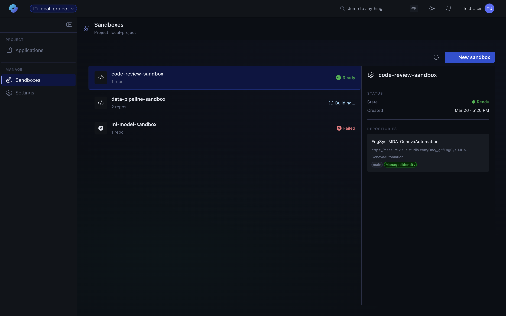
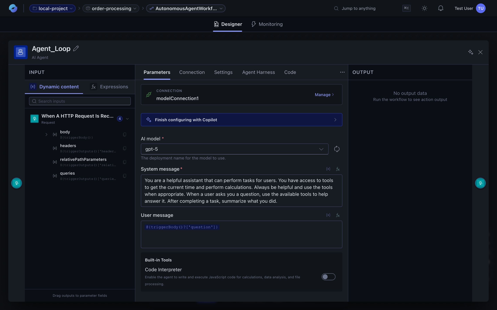
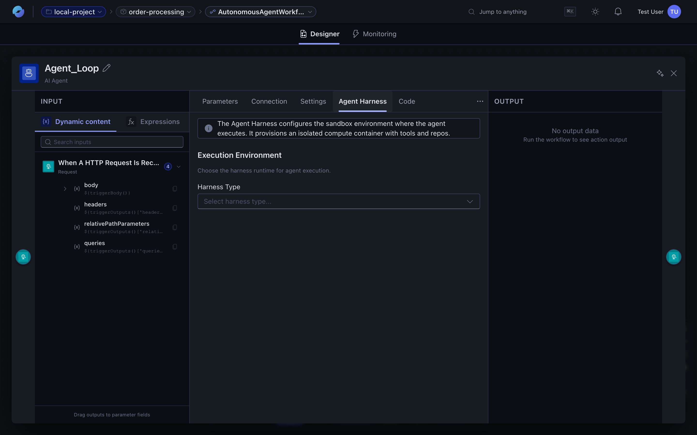
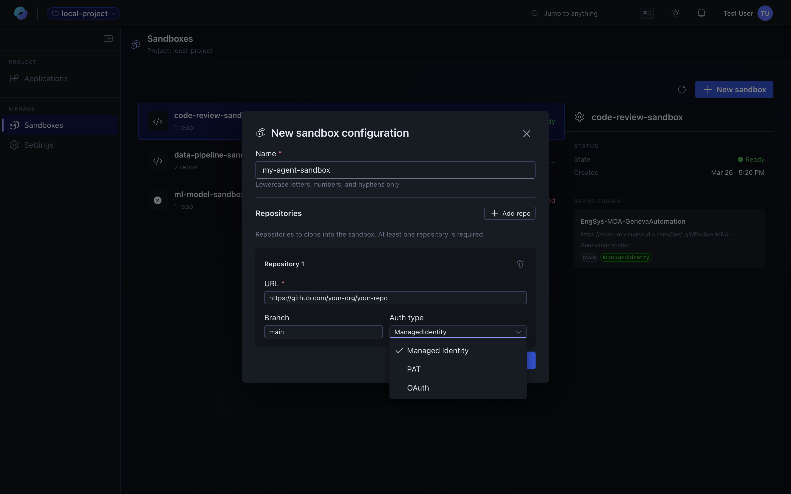
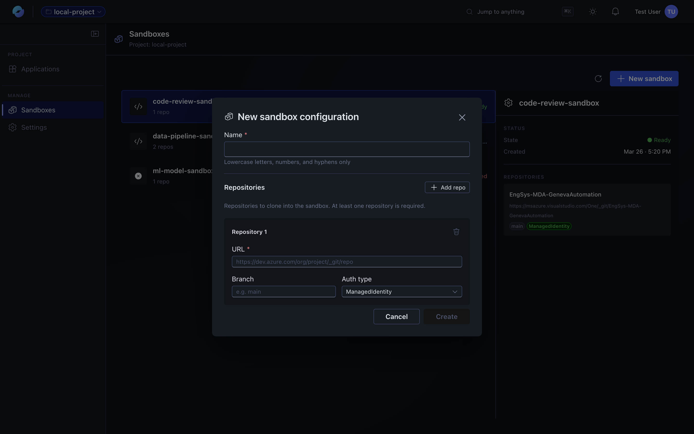
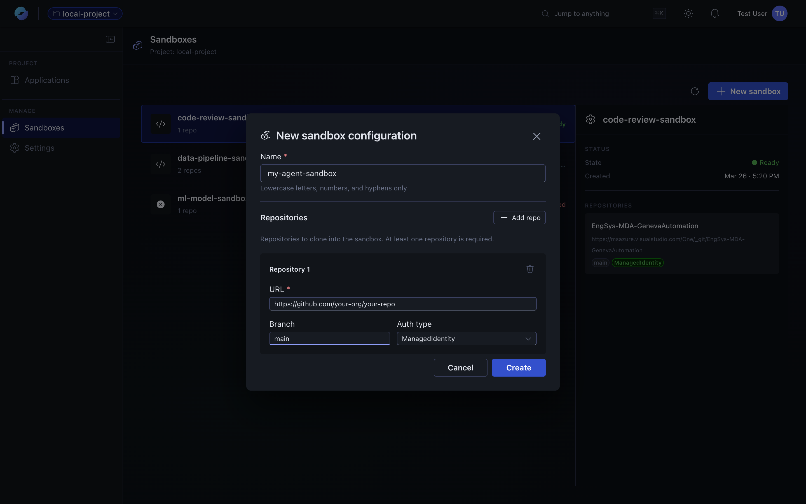

A **sandbox** is an isolated compute environment (a microVM, powered by Azure Developer Compute) that an agent workflow can run code in. Use it when an agent needs to:

- Run shell commands, scripts, or build tools.
- Browse a real filesystem.
- Operate on cloned source-control repositories.
- Invoke skills bundled with those repos.

Sandboxes live at the **project** level — multiple workflows across multiple apps can target the same sandbox, and the sandbox setup (auth, cloned repos, skills) is configured once.

## Sandboxes (project-scoped)

Sandboxes are isolated compute environments that workflow **agents** can run code in. They live at the project level so multiple workflows across multiple apps can reuse the same pre-baked image. See **[Sandboxes](/features/sandboxes/)** for the full guide.



## Two ways to use a sandbox

You can run agents in a sandbox **without any pre-configuration** (a clean image, just-in-time) or **with a pre-baked image** that already has your repos cloned and your skills available. Pick the path that matches what you need:

| Option | When to use it |
| --- | --- |
| **[Just-in-time sandbox](#option-1-just-in-time-sandbox)** | Quickest path. Try the sandbox experience, run general code, no custom repos needed. |
| **[Pre-baked sandbox with repos & skills](#option-2-pre-baked-sandbox-with-repos--skills)** | The agent needs your code — cloned repos, custom skills, dev tools. Image is built once and reused. |

---

## Prerequisites

For either path:

- A [project](/features/projects-and-applications/#project) you have access to.
- An [application](/features/projects-and-applications/#application) inside that project.
- A workflow inside the application — see [Quickstart](/getting-started/quickstart/) if you need to create one.

## Option 1 — Just-in-time sandbox

The simplest way to try the sandbox experience. No image-building, no repos to wire up. The sandbox is spun up on demand for the agent loop.

### Step 1 — Open the agent in the designer

In the workflow designer, click on the agent node to open its panel.



### Step 2 — Configure the Agent Harness

Switch to the **Agent Harness** tab. The Agent Harness configures the sandbox environment where the agent executes — it provisions an isolated compute container with tools and (optionally) repos.



Pick the **Harness Type** that matches your need:


### Step 3 — (Optional) Pass input files to the agent

If you want the agent to process files produced by upstream actions, add them in the **Input Files** section. Drag the relevant output from a previous action into the input-files target.

:::caution[Private preview limit]
**Input Files supports `.txt` and `.md` today.** Coverage for additional formats (e.g., `.csv`) will land before Public Preview. For now, if your file is `.csv`, add a `contentType` field in the code view (see the next step).
:::

### Step 4 — Save and (optionally) tweak the code view

Click **Add** to save the harness settings.

If you need to send a content type that isn't covered by the form (for example, a CSV input file), switch to the workflow's **Code** view and add the field directly:

```json
"contentType": "text/csv"
```

That's it — the next time the workflow runs, the agent will execute inside a fresh sandbox.

---

## Option 2 — Pre-baked sandbox with repos & skills

Use this path when the agent needs your codebase available. You build a **pre-baked disk image** once (with repos cloned and skills installed), then point the Agent Harness at it. Subsequent runs spin up instances from that image, so cold start stays low.

### Supported auth modes

| Auth | ADO | GitHub |
| --- | --- | --- |
| **PAT** | ✓ | ✓ |
| **Managed Identity** | ✓ (give the project's MI read access to the repo) | — |
| **OAuth** | — | ✓ |



### Step 1 — Create the sandbox configuration

In your project, open the **Sandboxes** tab and click **New sandbox**.



Fill in:

| Field | Notes |
| --- | --- |
| **Name** | Lowercase letters, numbers, and hyphens only. Workflows reference the sandbox by name. |
| **Repository → URL** | The ADO or GitHub HTTPS URL. |
| **Repository → Branch** | Branch to clone. |
| **Repository → Auth type** | See the matrix above. |



Click **Add repo** if you want to clone multiple repositories into the same sandbox.

### Step 2 — Connect to GitHub (OAuth path)

If you picked **OAuth** for a GitHub repository, you'll need an **Application resource** first, then click **Connect GitHub** in the dialog. A GitHub authorisation window opens — pick the account that owns the repo, then **Allow access** to let the platform read from it.

### Step 3 — Create the sandbox and wait for it to build

Click **Create**. The build kicks off and the sandbox enters a **Building…** state. Larger repos take longer; expect a few minutes for the first build.

When the build completes, the **State** turns **Ready**:


The detail panel on the right shows the cloned repositories and the auth mode used.

### Step 4 — Wire it into the Agent Harness

Open your workflow, click the agent, and go to the **Agent Harness** tab (same place as in Option 1). Now also:

1. Pick the **Harness Type** that matches your sandbox.
2. Under **Sandbox Configuration**, select the sandbox you created in step 1.
3. (Optional) Add **skills paths** by clicking **Repository skills** and pointing at the directories inside the cloned repo where your skills live.

Click **Add** to save, and run the workflow.

---

## Troubleshooting

| Problem | Try |
| --- | --- |
| **Sandbox stuck in *Building…*** | Refresh the list. If it stays building >10 min for a small repo, check the repo URL and credentials. |
| **Sandbox state shows *Failed*** | Open the detail panel for the error message. Common causes: bad URL, expired PAT, MI lacks read access. |
| **Agent Harness tab is missing from the agent node** | Confirm the agent node is selected (not a different action). The tab only appears for agent actions. |
| **Input file isn't reaching the agent** | Verify the file is `.txt` or `.md` in private preview, and that the `contentType` is set in the code view if needed. |
| **GitHub OAuth dialog never finishes** | Open the dialog again, confirm you allowed access at the account level, and that the repo belongs to that account. |

## What's next

- **[Agents](/features/agents/)** — how the agent action and tool loop work.
- **[AI workflow assistant](/features/ai-assistant/)** — ask the assistant to design a workflow that uses an agent with a sandbox.
- **[Runs and monitoring](/features/runs-and-monitoring/)** — inspect what the agent did inside the sandbox via per-action outputs.
