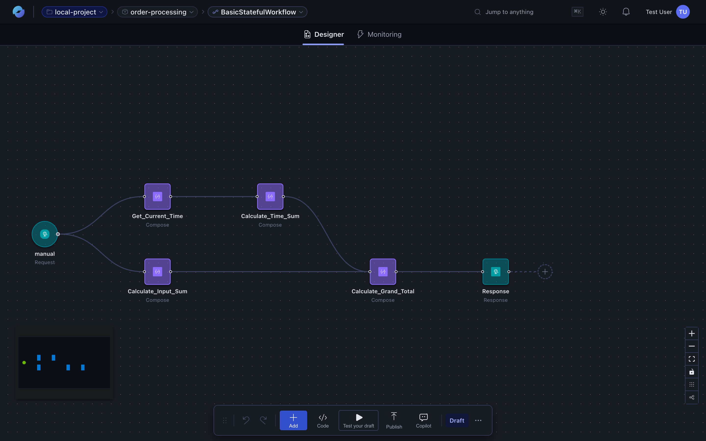
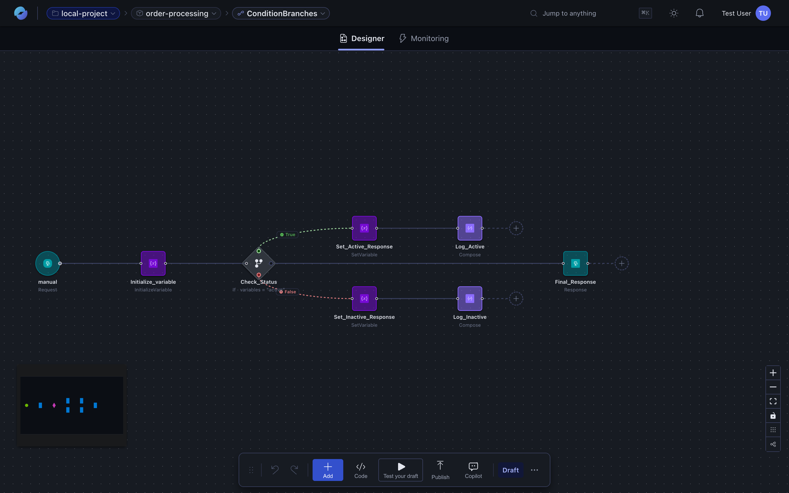

The **visual designer** is where workflows take shape. It's a drag-and-drop canvas built for developers — every node has a parameters panel, a code view, and an outputs view, so you can move fluidly between the visual representation and the underlying JSON.

## What you can build on the canvas

- **Triggers** — start a workflow from an HTTP call, a schedule, a queue message, an event, or another workflow.
- **Actions** — call connectors, run inline JavaScript, or invoke sub-workflows.
- **Control flow** — `if` / `else`, `switch`, `for-each`, `do-until`, and parallel branches.
- **Nested logic** — group actions into scopes; nest control-flow constructs as deeply as you need.
- **Variables and expressions** — capture intermediate values and reference them with Logic-Apps-style expressions.

## Conditional branches

The designer renders control-flow constructs visually. A workflow with conditions and parallel branches looks like this:

## Editing nodes

Click any node to open its **Parameters / Code / About** panel. Or open the entire workflow's JSON side-by-side with the canvas:

Changes you make in one view appear instantly in the other.

## Saving and running

Changes are kept in **draft mode** until you publish. Drafts let you iterate without affecting the running workflow. When you publish, the runtime picks up the new definition and the next trigger fires the latest version. Use **Test your draft** to run the draft with a test payload before publishing.
