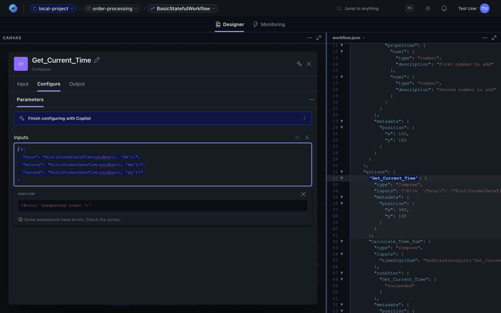
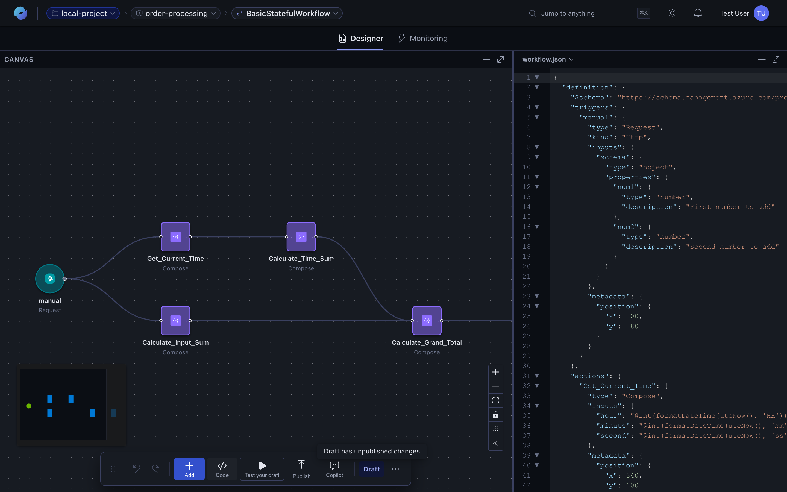
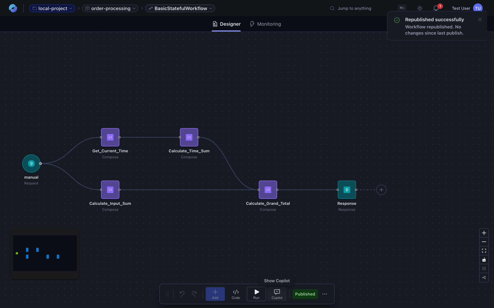

In Azure Logic Apps Automation, a **workflow** is a trigger plus a sequence of actions. You compose them on the visual canvas or via the assistant; the runtime executes them and keeps run history for inspection. Workflows can be stateful or stateless with triggers, actions, control flow, expressions, IntelliSense, inline code execution such as JavaScript, and more.

| [Workflow](/features/workflows/) | The automation workload that includes operations such as the starting event (*trigger*) and the tasks to perform or control flow (*actions*). Workflows are stateful or stateless. They support expressions, IntelliSense, inline code execution such as JavaScript, and more. |

## Triggers

Workflows can start from:

- **HTTP / HTTPS** — call the workflow as a webhook.
- **Schedule / Recurrence** — every minute, hour, day, or cron expression.
- **Queue / topic** — Service Bus, Event Hubs, Storage queue.
- **Connector events** — many managed connectors expose triggers (e.g., new email, new file).
- **Another workflow** — invoke this workflow from a parent.

## Actions

Actions fall into a handful of categories:

| Category | Examples |
| --- | --- |
| **HTTP** | Generic REST calls — `GET`, `POST`, etc. |
| **Built-in** | Compose, Parse JSON, Variables, Inline JavaScript. |
| **Connectors** | Built-in (Service Bus, Storage, …) and managed (Outlook, Teams, SharePoint, …). |
| **Control flow** | `if`, `switch`, `for-each`, `do-until`, parallel branches. |
| **Agents** | AI-driven actions with a system prompt and a toolset. See [Agents](/features/agents/). |

## Expressions and dynamic content

Every action's parameters accept either a literal value or a **dynamic** value computed from earlier steps. Click into any field and the **Dynamic content / Expressions** panel opens on the left, with two modes:

- **Dynamic content** — drag any output from the trigger or an earlier action into the field. Outputs appear as named tokens (`triggerBody().num1`, `outputs('Get_Current_Time')`).
- **Expressions** — write a function call using the platform's expression language: `@add(triggerBody()?.num1, 5)`, `@formatDateTime(utcNow(), 'yyyy-MM-dd')`, `@if(empty(variables('orders')), 'none', 'present')`.



The same expression syntax works wherever a value is accepted — node parameters, conditional branches, loops, agent system prompts. The panel includes a live preview so you can validate the result before saving. 

### JavaScript actions

For logic that's hard to express as a function call — string parsing, complex data shaping, multi-step calculation — drop in a built-in **Inline JavaScript Code** action. It runs in a sandboxed Node.js runtime, takes JSON inputs from the workflow, and returns a value the rest of the workflow can read.

```js
// Action: Inline JavaScript Code
const orders = workflowContext.actions.Fetch_Orders.outputs.body;
return orders
  .filter(o => o.total > 100)
  .map(o => ({ id: o.id, customer: o.customerName, total: o.total }));
```

Use it sparingly — most transformations are clearer as a chain of built-in actions, and the JS sandbox can't make network calls. For network-bound logic, use the **HTTP** action instead.

## Code view + IntelliSense

The code view (toggle on the bottom toolbar) opens the workflow's JSON side-by-side with the canvas. Both views stay in sync — edit either, the other updates.



Inside the editor:

- **Auto-completion** — start typing and the editor suggests matching action types, expression functions, and known properties of the schema. Press `Ctrl + Space` (or `⌃ Space`) to force the popover.
- **Signature help** — typing a function call shows the function's signature and parameter docs inline.
- **Hover docs** — hover any property to see its type and description.
- **Schema-aware diagnostics** — invalid action types, malformed expressions, and missing required fields are underlined with a tooltip explaining the problem.

The same editor backs every place a code surface appears — the workflow code view, inline JavaScript actions, and the expression input — so the same auto-completion and validation are available everywhere.

## Stateful vs stateless

- **Stateful** workflows persist their full run history and support replay, retry, and long-running operations.
- **Stateless** workflows run in-memory only and are optimised for short, fast executions.

Pick the mode when you create the workflow. You can change it later in `workflow.json` (`"kind": "Stateful"` / `"Stateless"`).

## Draft vs published

Every workflow has two versions: a **draft** (what you're editing) and the **published** version (what real traffic hits).

| | Draft | Published |
| --- | --- | --- |
| What it is | Your current in-progress edit | The live version triggers actually fire against |
| Where edits go | Auto-saved here while you work | Updated only when you click **Publish** |
| Indicator | **Draft** pill on the canvas toolbar | **Published** pill on the canvas toolbar |
| Run history bucket | Shown under "Drafts" in the Monitoring view | Shown as "Production" runs |



**Publishing** copies the draft on top of the published version. There's no separate "deploy" step — the next trigger fires the new version.

### Which triggers fire from a draft?

Not every trigger respects drafts. The pattern is: anything **manually invokable** works against drafts; anything **time- or event-driven** only fires against the published workflow.

| Trigger kind | Fires from a draft? | How to test |
| --- | --- | --- |
| HTTP / Request, manual | ✅ | Click **Test your draft** in the designer (or the **Run workflow** button in the Monitoring tab) and provide a payload. |
| Schedule / Recurrence | ❌ — published only | Publish first; then wait for the scheduled time (or shorten the schedule temporarily). |
| Event-driven (Service Bus, Event Hubs, Storage queue) | ❌ — published only | Publish first; then push an event to the source. |
| Connector polling triggers (SaaS new-item-detected, etc.) | ❌ — published only | Publish first; then trigger the event in the source SaaS app. |

For a full end-to-end test of a non-HTTP trigger, the workflow has to be published. Iterate quickly on HTTP-triggered workflows with **Test your draft**, then publish once everything looks right.

## Local authoring

The fastest way to experiment is right in the [portal](https://auto.azure.com). Workflows you save publish to a draft you can run on-demand before you publish over the live version. See the [Quickstart](/getting-started/quickstart/) to walk through building your first one.

## Related content

- [Quickstart](/getting-started/quickstart/)
- [Visual designer](designer)
- [AI assistant](ai-assistant)
- [Connectors](connectors)
