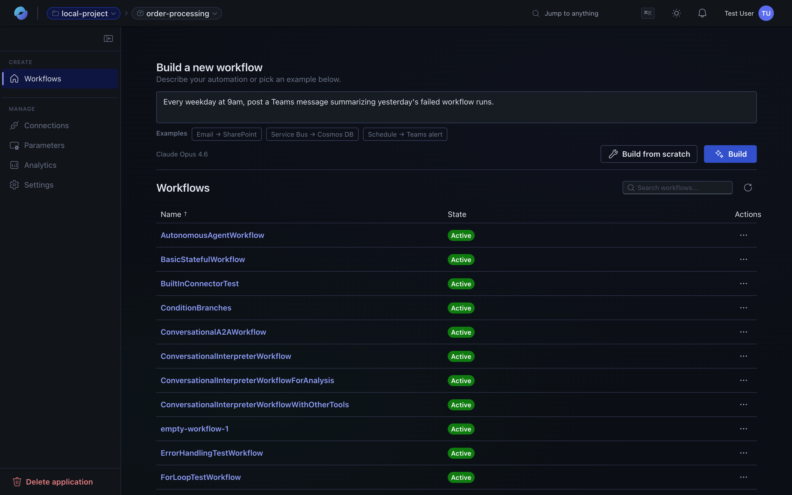
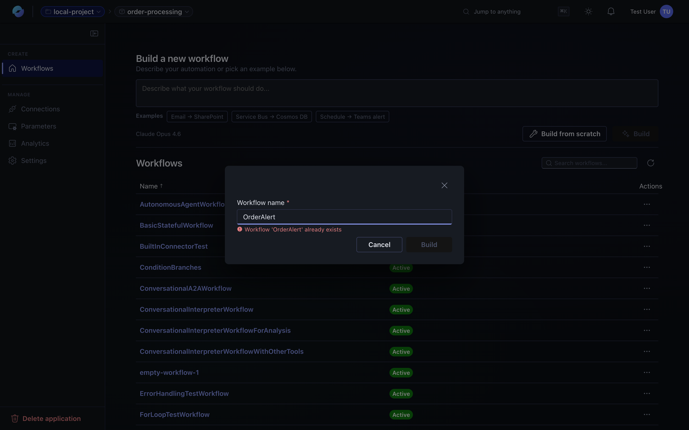
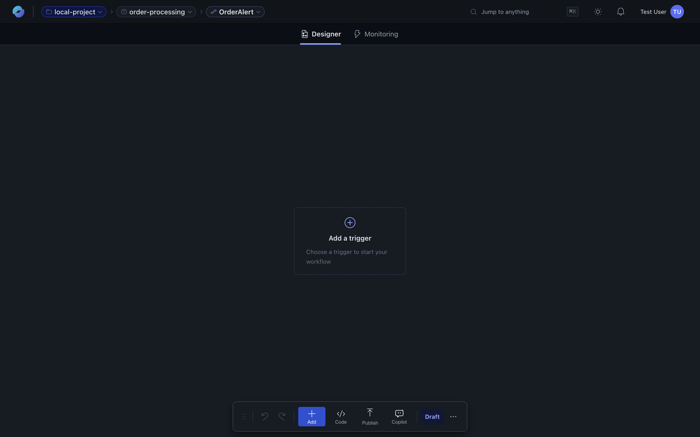
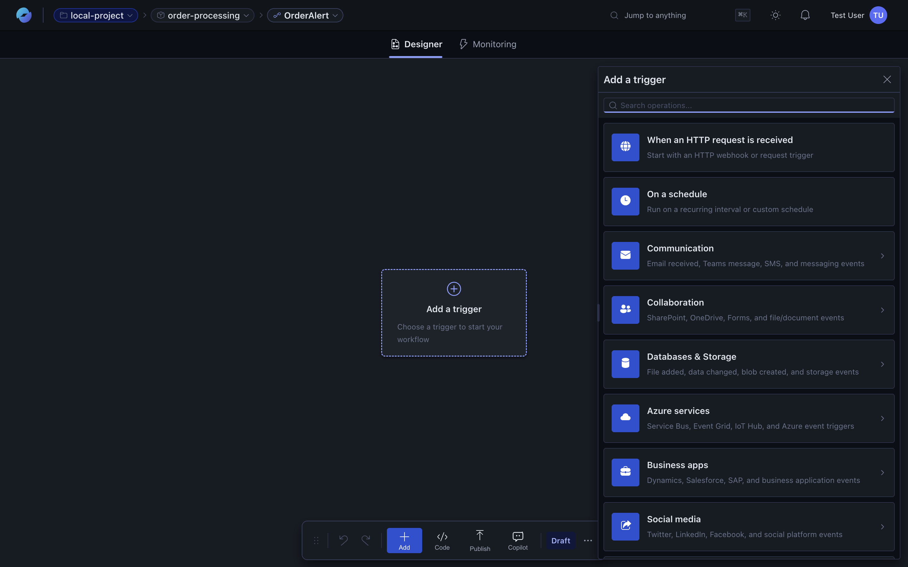
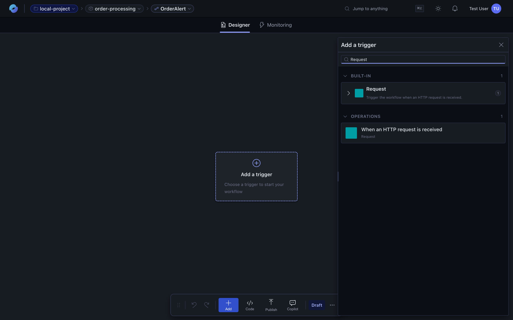
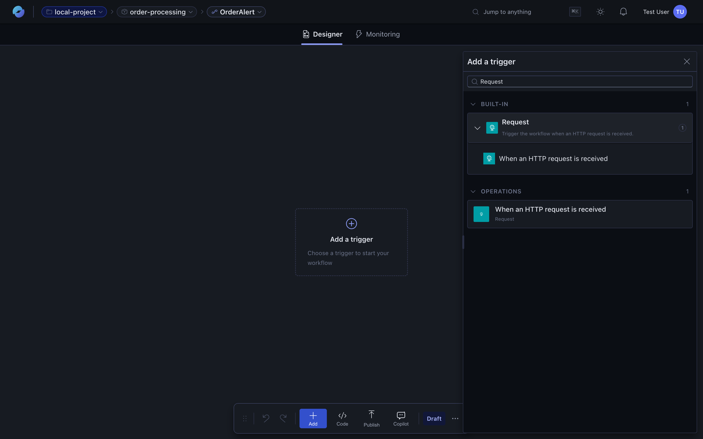
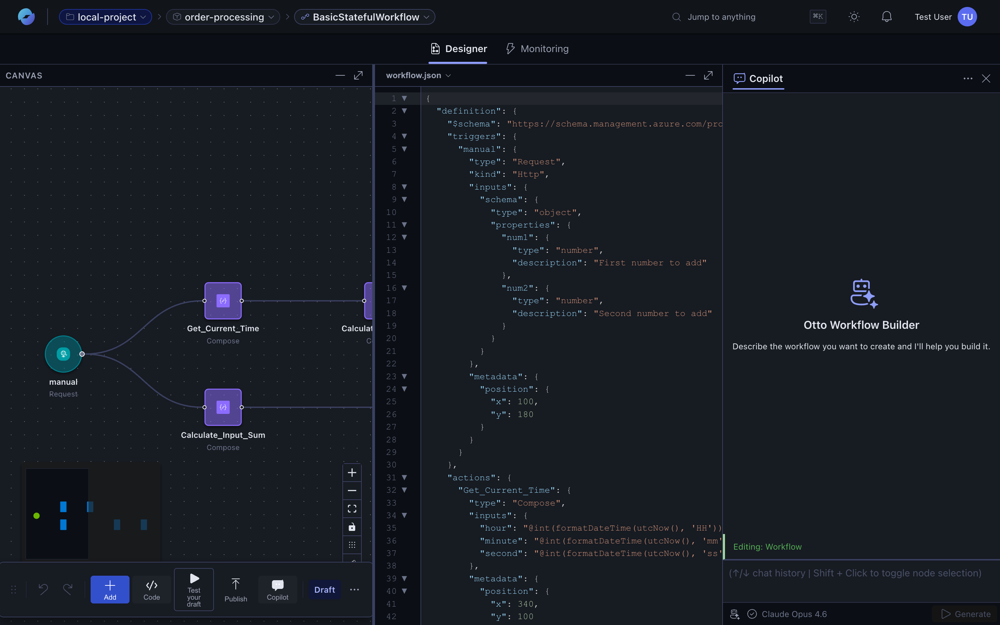
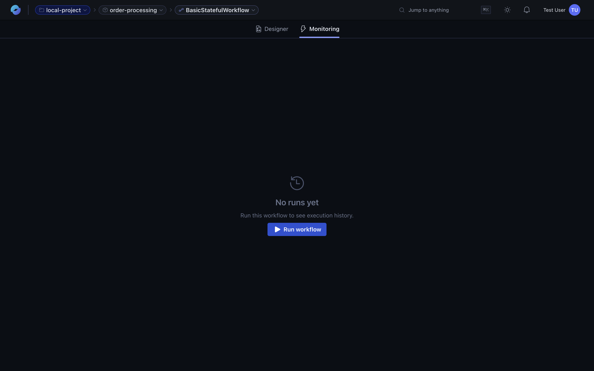
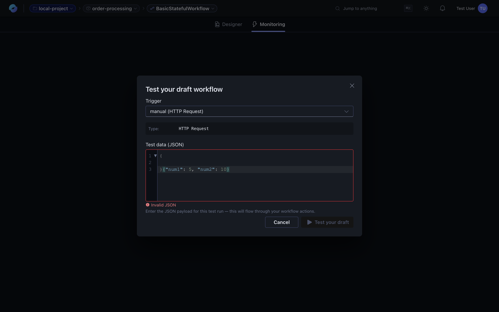

This page walks the whole loop: open an app, create a workflow, save it as a draft, run it, and inspect what happened. Use it as a template and swap in whatever you actually want to automate.

## 1. Open your project

Sign-in takes you to the dashboard, where you see every **project** you have access to. A project is the top-level container for your work — each project holds applications, sandboxes, connections, and settings.

Click a project to open it.

## 3. Browse applications

Inside a project, the default tab is **Applications**. An *application* is a deployable unit that holds **workflows, connections, parameters,** and **analytics** together. Most teams have a handful of apps per project — one per logical service or domain.

The left rail surfaces the rest of the project surface — **Sandboxes** for experimentation and **Settings** for project-level configuration.

## 1. Open an application

From your project's **Applications** tab, click an app. The app shell opens with five sections in the left rail — **Workflows**, **Connections**, **Parameters**, **Analytics**, and **Settings**.

The **Workflows** tab is your default view: a workflow builder at the top and the list of existing workflows below.

:::tip[No applications yet?]
A fresh project starts empty. Click **Create application** on the project's **Applications** tab, give it a name, and submit.

App provisioning takes a minute or two — watch the **Status** column flip from *Building* to **Ready** before opening it.

Want collaborators? Open the application's **Settings → User permissions** tab and invite them, or invite them at the project level if they need access to every app. See [Permissions](/features/permissions/).
:::

## 2. Pick a path: assistant or scratch

You have two ways to start a workflow.

**Use the assistant.** Type what you want into the *"Describe what your workflow should do…"* box. The assistant generates the workflow and drops you onto the canvas.

**Build from scratch.** Click **Build from scratch** to start with a blank canvas. The dialog asks for a workflow name:

Either path lands you in the designer. The rest of this page uses *build from scratch* so every step is visible.

## 3. Add a trigger

Every workflow starts with a trigger. The empty canvas shows an **Add a trigger** placeholder:

Click it to open the picker:

Search for the integration you want — `Request` for an HTTP webhook trigger, `Schedule` for recurrence, or any connector that exposes triggers.

Select an operation (for example, *When an HTTP request is received*) to add it to the canvas:

## 4. Add actions

Click the **+** between (or after) nodes to add the next step. Pick a connector or built-in action, fill in its parameters, and continue. Compose-style branching shows up automatically when actions can run in parallel.

A complete workflow with parallel branches and a final response looks like this:

The bottom toolbar gives you canvas-wide controls:

- **Add** — quick-add a node anywhere on the canvas.
- **Code** — open the raw JSON view side-by-side with the canvas (next section).
- **Test your draft** — run the workflow with a test payload without publishing.
- **Copilot** — open the assistant in the designer to iterate on the workflow.
- **Draft** — the indicator showing you're editing the unpublished version.

## 5. Edit in code or with copilot

Switch to the code view for hand-edits. Canvas and JSON stay in sync — change either, the other updates:

Or open the assistant inside the designer to iterate on the workflow with natural language:

:::caution[Workflows from Copilot still need configuration]
Copilot scaffolds the workflow shape — triggers, actions, branching — but it can't guess your credentials or environment-specific values. Before the first run succeeds you'll need to:

- **Configure connections** for each connector action (the app's **Connections** tab, or per-node *Connection* tab in the designer).
- **Fill required parameters** the assistant left blank — look for fields marked with an asterisk or red outline.
- **Resolve any "Finish configuring with Copilot" prompts** that appear on individual nodes.

Click **Test your draft** (see step 7) to surface any missing config quickly.
:::

## 6. Save the draft, then publish

Changes you make are saved to a **draft** of the workflow. The pill on the bottom toolbar shows the current state — **Draft** (unpublished changes) or **Published** (in sync with production). Click **Publish** to promote the draft.

:::caution[Some triggers only fire on the published workflow]
Not every trigger respects the draft. As a rule of thumb:

| Trigger kind | Fires from a draft? | How to test |
| --- | --- | --- |
| HTTP / Request, manual | ✅ | Use **Test your draft** (step 7) to fire with a custom payload. |
| Schedule / Recurrence | ❌ — published only | Publish, then wait for the scheduled time (or shorten the schedule). |
| Event-driven (Service Bus, Event Hubs, Storage queue) | ❌ — published only | Publish, then push an event to the source. |
| Connector triggers that poll a SaaS endpoint | ❌ — published only | Publish, then trigger the event in the source SaaS app. |

For a full end-to-end test of any non-HTTP trigger, publish the draft first.
:::

See [**Draft vs published**](/features/workflows/#draft-vs-published) for the full mental model.

## 7. Run the workflow

Switch to the **Monitoring** tab. If the workflow has never run, you'll see the empty state and a **Run workflow** button:

Click **Run workflow** to fire it manually. A test-payload dialog opens — pick the trigger and provide any JSON body the trigger needs:

Click **Test your draft** to execute. The monitoring view streams the run as it happens.

## 8. Read the run history

After a run completes, the **Monitoring** tab shows it in the left rail with status, timestamp, and duration:

Click the run to open its detail view — the canvas re-renders coloured by execution status, every node shows its duration, and the **Execution log** at the bottom lists every action in order:

## 9. Inspect inputs, outputs, and errors

Click any action in the execution log (or any node on the canvas) to see what data it received and produced. The **Output**, **Input**, and **Properties** tabs in the bottom panel let you drill in:

Triggers behave the same way — click `manual` (or whatever the trigger node is called) to see what came in:

For failed actions, the same panel shows the error message and stack trace so you can diagnose without leaving the run view.

## 10. Iterate

Edit the workflow in the designer or send follow-ups to the assistant (*"add error handling to the HTTP action"*, *"use a Slack post instead"*). Changes go into a draft until you publish.

## Troubleshooting

| Problem | Try |
|---------|-----|

| **Sign in loop or single sign-on (SSO) error** | Clear your cookies for the following URLs, and sign in again:   - `https://auto.azure.com`  - `https://login.microsoftonline.com` |
| **Portal appears empty** | Perform a hard refresh (Keyboard: `Cmd/Ctrl + Shift + R`). If the problem persists, [report a bug](/support/report-a-bug/). |

## Where to go from here

- **[Visual designer](/features/visual-designer/)** — what the canvas can do.
- **[AI workflow assistant](/features/ai-assistant/)** — patterns that work well with the assistant.
- **[Connectors](/features/connectors/)** — the catalog of integrations.
- **[Runs and monitoring](/features/runs-and-monitoring/)** — read run history and watch production health.
- **[Report a bug](/support/report-a-bug/)** if something didn't work.
