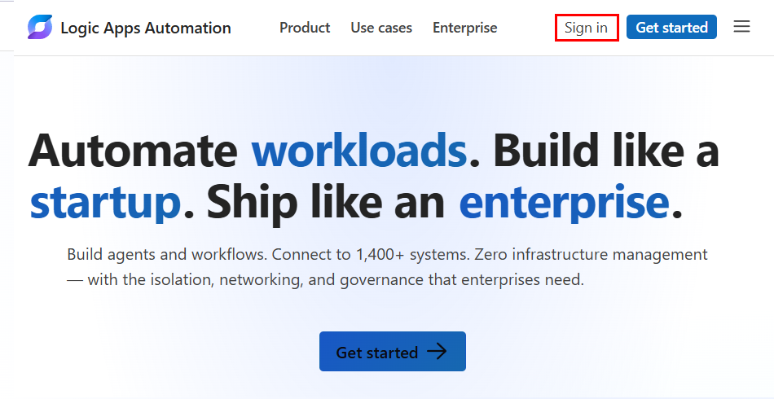

When your team builds automation solutions, keep your apps, their workflows, connections, and other items organized, secure, and separate so that unrelated work doesn't cross boundaries. Otherwise, automation assets become harder to manage, govern, and scale as your team grows.

In Azure Logic Apps Automation, an *environment* is a top-level, isolated container that solves this problem by providing its own compute, networking, security, and governance. As your first step, create an environment to store your apps and their contents. You can create an environment per team, business area, or scenario so your teams can independently build and manage their automations.

Azure Logic Apps Automation organizes your work at the following levels:

| Level | Contents |
|-------|----------|
| [*Environment*](/getting-started/introduction/#key-components-and-concepts) | The top-level, parent container that stores *apps*. As the environment creator and default owner, you control access and governance at this level. |
| [*App*](/getting-started/introduction/#key-components-and-concepts) | A deployable package that stores workflows, connections, parameters, analytics, settings, and other items that your automation needs. |
| [*Workflow*](/getting-started/introduction/#key-components-and-concepts) | The automation workload itself, which includes the starting event ([*trigger*](/getting-started/introduction/#key-components-and-concepts)) and the steps ([*actions*](/getting-started/introduction/#key-components-and-concepts)) to run. |

This guide shows how to create an environment if you don't have one yet and add team members to your environment.

For more information, see:

- [What is Azure Logic Apps Automation](/getting-started/introduction/)
- [Key concepts and terminology](/getting-started/introduction/#key-components-and-concepts)

## Requirements

- An Azure account and subscription that uses a Microsoft work or school account so you can create environments. [Get a free Azure account](https://azure.microsoft.com/pricing/purchase-options/azure-account?cid=msft_learn_c4e22ddd-ca68-7d5b-5f0d-0c961983e0ef).

  :::note
  You need an Azure subscription only to create environments. Make sure your account can access the [Azure Logic Apps Automation portal](https://auto.azure.com).
  :::

- To add a team member to your environment and for them to create apps and workflows, they need the following items:

  - A Microsoft work or school account in your Microsoft Entra tenant. No Azure subscription necessary.
  - Access to the automation portal.

  For more information about Microsoft Entra tenants, see [Tenant configurations](https://learn.microsoft.com/entra/identity-platform/v2-overview#tenant-configurations).

## Create your environment

1. Sign in to the [Azure Logic Apps Automation portal](https://auto.azure.com) with your Azure account.

   

1. On the **Environments** tab, select **Create environment**.

1. In the **Create automation environment** box, provide the following information:

   | Property | Description |
   |----------|-------------|
   | **Subscription** | Your Azure subscription. |
   | **Resource group** | The [Azure resource group](https://learn.microsoft.com/azure/azure-resource-manager/management/overview#terminology) for organizing your environment resources. Enter a unique name across Azure regions that uses only alphanumeric characters, hyphens (`-`), underscores (`_`), parentheses (`()`), or periods (`.`). |
   | **Region** | The Azure region closest to your end users or the components that your workflows need to use. |
   | **Name** | A unique environment name across Azure regions that uses only alphanumeric characters, hyphens (`-`), underscores (`_`), parentheses (`()`), or periods (`.`). |

1. When you finish, select **Create**.

   :::note
   The environment creation process might take several minutes to finish.
   :::

1. After the portal creates your environment, select your environment.

1. Before others can work in your environment to create apps and workflows, [add them as environment members](#add-environment-members).

1. Before you or others can start building workflows, [create an app](/getting-started/quickstart/#2-create-an-app) as a deployable package for your workflows.

## Environment ownership and privacy

As the environment creator, you automatically:

- Become the environment owner and appear in the **Owner** environment property, which is a property, not a permission level. You can't clear or remove this property value.
- Have [**Contributor** role permissions](/features/permissions/#environment-roles) on the environment resource.
- Have administrator-level permissions to delete the environment and its resources, such as apps or sandboxes, including items you don't own. Non-owner members with the **Contributor** role can't perform these tasks.

For more information, see [Permissions](/features/permissions/).

## Add environment members

Before others can create apps and workflows in your environment, add them as environment members:

1. In the [Azure Logic Apps Automation portal](https://auto.azure.com), find and open your environment.

1. On your environment home page, on the sidebar, select **Settings**.

1. In the **Users** section, select **Add user**.

1. On the **Add role assignment** pane, in the **Select user** box, enter the name or the email address for the person you want to add.

   The **Select user** list shows only people in the same Microsoft Entra tenant as you.

1. From the results, select the correctly matching person.

1. After the **Role** section appears, select the role the person needs, based on the principle of least privilege, and then select **Add**.

   The following table describes the available roles at the environment level, what they can do, and what they can't do:

   | Role | Can | Can't |
   |------|-----|-------|
   | **Reader** (view only) | - View only the environment settings, members list, sandbox configurations, and shared resources.  - View workflow run history. | - Create, edit, or delete anything.  - View apps.  - Trigger or cancel workflow runs.  - Manage permissions. |
   | **Author** | - Create apps, sandbox configurations, and shared resources.  - View the environment settings, members list, and sandbox configurations. | - Edit the environment settings and manage environment members.  - View apps or their content without explicit app-level permissions. |
   | **Contributor** | - View and edit environment settings, manage the environment, and manage environment members.  - Create apps, but view only metadata for others' apps.  - Create and edit sandbox configurations.  - View workflows, connections, and parameters.  - Create, edit, and delete workflows.  - Create and edit connections.  - View workflow run history.  - Trigger and cancel workflow runs.  - Manage app permissions. | - Delete the environment (owner only).  - View app content without explicit app level permissions. |

   By default, apps are always private, which means that only their creators (owners) can view and access their apps. They're invisible to other environment members until the creator-owner explicitly shares them.
   
   Environment contributors or owners can view app metadata for governance, but not the content. Apps often contain automation that connects to personal accounts. So, privacy by default keeps this data obscured unless explicitly shared.
   
   sApp owners or contributors can explicitly add members by granting app-level roles. To grant access to a specific app, open that app, go to **Settings**, **User permissions**, and add the member you want.

## Next

- [Quickstart](/getting-started/quickstart/)
- [Troubleshoot problems](/getting-started/troubleshoot/)
