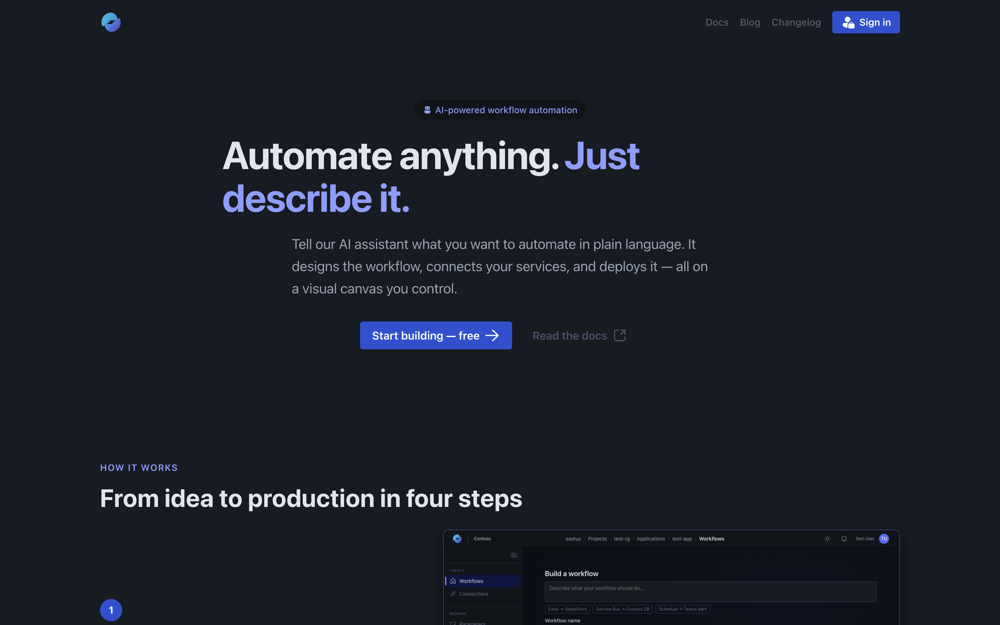
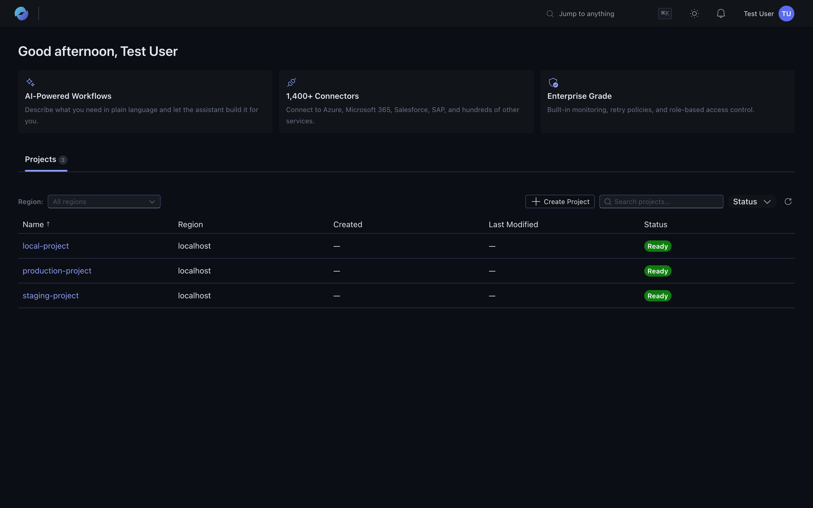

The platform runs in your browser. There's nothing to install.

## 1. Open the portal

Go to **[auto.azure.com](https://auto.azure.com)** and sign in with your work or school account.

## 2. Pick an environment

Sign-in takes you to the dashboard, where you see every **environment** you have access to. An environment is the top-level container for your work — each environment holds applications, sandboxes, connections, and settings.

Click an environment to open it.

## 3. Browse applications

Inside an environment, the default tab is **Applications**. An *application* is a deployable unit that holds **workflows, connections, parameters,** and **analytics** together. Most teams have a handful of apps per environment — one per logical service or domain.

The left rail surfaces the rest of the environment surface — **Sandboxes** for experimentation and **Settings** for environment-level configuration.

## Troubleshooting

| Problem | Try |
| --- | --- |
| **"You don't have access to any environment"** | Ask an environment admin to invite you, or create your own environment from the empty state. |
| **Login loop / SSO error** | Clear cookies for `auto.azure.com` and `login.microsoftonline.com`, then sign in again. |
| **Portal looks blank** | Hard-refresh (`Cmd/Ctrl + Shift + R`). If it persists, [report a bug](/support/report-a-bug/). |

## Next

You've found your environments and apps — continue to the **[Quickstart](/getting-started/quickstart/)** to build your first workflow.
