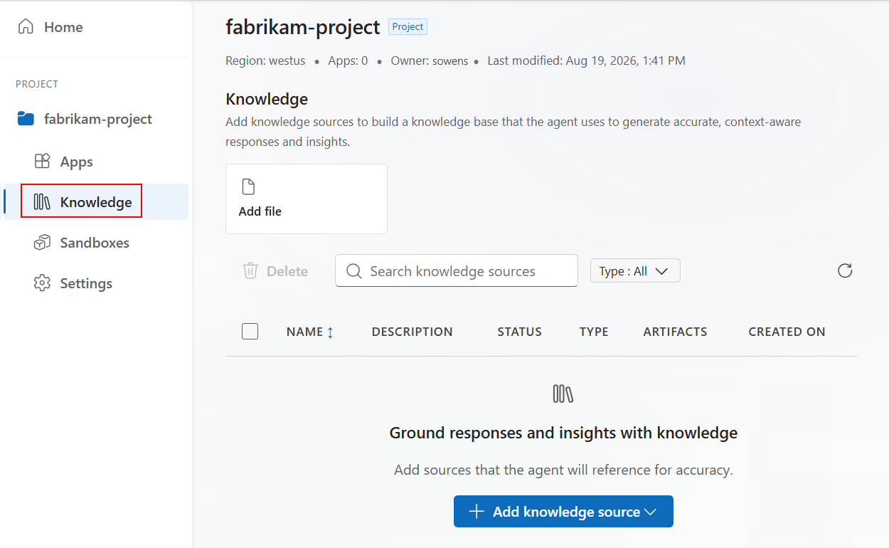
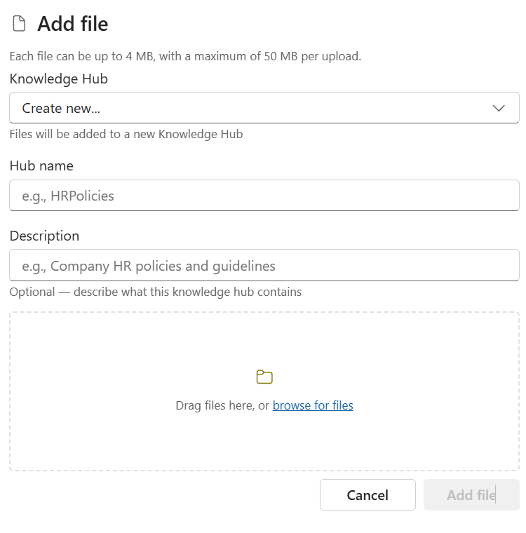

:::note
This capability is in preview and subject to the [Supplemental Terms of Use for Microsoft Azure Previews](https://azure.microsoft.com/support/legal/preview-supplemental-terms/). If your project enables this capability, the user experience appears in the [portal](https://auto.azure.com).
:::

In Azure Logic Apps Automation, create a [*knowledge base*](/features/knowledge-bases/) as an external context source that an [agent](/features/agents/) can search during reasoning. Rather than rely only on a model's training, the agent gets the relevant information from your files, docs, code, and data to ground its answers.

The following items are under development:

- Document upload size and format limits.
- Per-source token budget controls.
- Granular permissions on which project members can attach a source.

If you encounter problems, [report a bug](/support/report-a-bug/) so your feedback can help shape future releases.

## Requirements

- A Microsoft work or school account in the same Microsoft Entra tenant as the project creator-owner.

  Your account must exist in the same tenant so the project creator-owner can add you to the project. You don't need an Azure subscription to create apps and workflows in an automation project.

- Access to the [Azure Logic Apps Automation portal](https://auto.azure.com).

- **Contributor** or **Author** role on the [project resource](/features/projects-and-applications/#project) to create knowledge bases.

  :::note
  The project **Reader** role doesn't have enough permissions to create knowledge bases.
  :::

  If you don't have project access, contact the project creator-owner so they can add you with the required permissions.

## Create a knowledge base

Before you can attach a knowledge base to your agent, other than files to upload, create the knowledge base or add an existing knowledge source to your project. 

1. In the [Azure Logic Apps Automation portal](https://auto.azure.com), open your project.

1. On the project sidebar, select **Knowledge**.

1. Select **Add file** or **Add knowledge source** > **Add file**.

   

   1. Enter a name and description for your knowledge base.

   1. Drag or browse and select the files you want. Select **Add file**.

   

## Add another knowledge base

To add another knowledge base when you have existing ones, follow these steps:

1. In the [Azure Logic Apps Automation portal](https://auto.azure.com), open your project.

1. On the project sidebar, select **Knowledge**.

   The portal opens your existing knowledge base.

1. In the **Knowledge** section, select **Add file**.

1. In the **Add file** box, for **Knowledge Hub**, select **Create new**.

   1. Enter a name and description for your knowledge base.

   1. Drag or browse and select the files you want. Select **Add file**.

## Attach a knowledge source to your agent

1. In your workflow, on the designer, select the agent action.

1. In the agent information pane, select the **Knowledge** tab.

1. Select **Add files** or **Add knowledge source**.

   - **Add files**: Enter a name and description for your knowledge base. Drag or browse and select the files you want. Select **Add file**.
   - **Add knowledge source**: Select the knowledge sources you want.

1. When you're done, close the pane.

At the next run time, the agent retrieves related information from the source before calling the model. The agent queries each attached source by using agent's instructions and inputs. The agent adds the top results to the model's context. The model chooses which results to cite, if any.

## Troubleshoot information retrieval problems

To debug problems related to agent responses based on stale data or not finding the correct information, open the [workflow run history](/features/runs-and-monitoring/) so you can examine the query and retrieved information. Each time that the agent retrieves information is a step in the agent's iterations. These steps appear as entries under the agent action's inputs and outputs:

- **Inputs**: Shows the query used by the runtime. The model often rewrites the agent's instructions.
- **Outputs**: Shows the retrieved information with a relevance score per result.

Usually, these problems arise due to chunking or queries with rewritten instructions.

## Related content

- [Agents](/features/agents/)
- [Sandboxes](/features/sandboxes/)
- [Connectors](/features/connectors/)
- [Runs and monitoring](/features/runs-and-monitoring/)