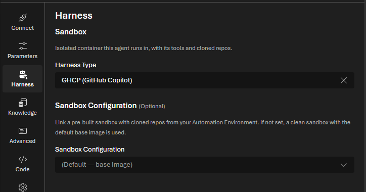
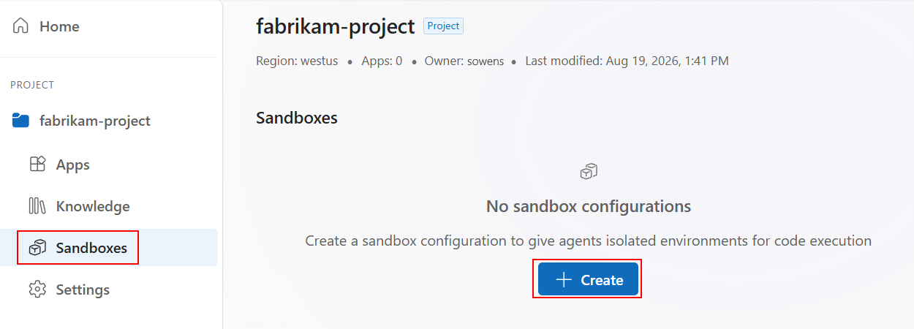

:::note
This capability is in preview and subject to the [Supplemental Terms of Use for Microsoft Azure Previews](https://azure.microsoft.com/support/legal/preview-supplemental-terms/). If your environment enables this capability, the user experience appears in the [portal](https://auto.azure.com).
:::

In Azure Logic Apps Automation, use a [*sandbox*](/features/sandboxes/) as an isolated compute environment where a Managed Agent can run commands, work with files and cloned repositories, and use repository skills.

## Requirements

- A Microsoft work or school account in the same Microsoft Entra tenant as the environment creator-owner.

  Your account must exist in the same tenant so the environment creator-owner can add you to the environment. You don't need an Azure subscription to create apps and workflows in an automation environment.

- Access to the [Azure Logic Apps Automation portal](https://auto.azure.com).

- Access to your automation [environment](/features/projects-and-applications/#environment).

- To create a prebuilt sandbox configuration, the **Contributor** or **Author** role on the [environment resource](/features/projects-and-applications/#environment).

  :::note
  The environment **Reader** role doesn't have enough permissions to create sandboxes.
  :::

  If you don't have environment access, contact the environment creator-owner so they can add you with the required permissions.

- To clone a private GitHub repository by using OAuth, the Logic Apps Automation GitHub App must be installed for the GitHub account or organization that owns the repository and configured with access to that repository. Go to [GitHub Apps - Logic Apps Automation](https://github.com/apps/logic-apps-automation), select **Configure**, and grant the app access to the repository. If you can't configure the installation for an organization, ask a GitHub organization owner to grant access.

- To use a sandbox in a workflow:

  - An [app](/features/projects-and-applications/#apps) in your environment.
  - A [workflow](/features/workflows/) in your app.
  - A [Managed Agent](/features/agents/#native-agent-concepts-and-components) in the workflow.

## Use the default sandbox

The default sandbox provides the fastest way to try Managed Agent tasks in a clean environment. You don't create a sandbox configuration or add repositories. The platform starts the default base image on demand for each run.

1. In the [Azure Logic Apps Automation portal](https://auto.azure.com), open your environment, app, and workflow.

1. On the workflow designer, select the Managed Agent action.

1. In the action information window, select the **Harness** tab.

   

1. Under **Sandbox**, for **Harness Type**, select **GHCP (GitHub Copilot)** as the harness runtime to use for agent execution.

   **GHCP (GitHub Copilot)** is the default harness and the only available option at this time.

1. For **Sandbox Configuration**, keep **(Default — base image)** selected.

   To use cloned repositories or repository skills, see [Create a prebuilt sandbox](#create-a-prebuilt-sandbox).

   To provide files from earlier workflow actions, see [Pass input files to a Managed Agent](#pass-input-files-to-a-managed-agent).

1. When you finish, close the action information window.

When the workflow runs, the Managed Agent runs in a new isolated sandbox instance based on the default image.

## Create a prebuilt sandbox

When a Managed Agent needs cloned repositories, repository skills, or a specific compute size, create a reusable prebuilt sandbox configuration. Creating the configuration builds an image that workflows across apps in the environment can use.

### 1. Create the configuration

1. In the [Azure Logic Apps Automation portal](https://auto.azure.com), open your environment.

1. On the environment sidebar, select **Sandboxes**, and then select **Create**.

   

1. In the sandbox setup window, provide the following information:

   | Property | Description |
   |---|---|
   | **Name** | The name for the sandbox configuration. Use only lowercase letters, numbers, and hyphens. The name `default` is reserved. You can't change the name after creation. |
   | **Resource tier** | The CPU, memory, and disk budget for each sandbox instance. The default tier is M. |
   | **Repositories** | One or more repositories to clone into the image. At least one repository is required. For each repository, provide the URL, branch, and authentication type. Repository URLs must start with `https://` or `http://`. |

   The following resource tiers are available:

   | Tier | CPU | Memory | Disk budget |
   |---|---:|---:|---:|
   | **XS** | 0.25 core | 0.5 GB | 5 GB |
   | **S** | 0.5 core | 1 GB | 10 GB |
   | **M** | 1 core | 2 GB | 20 GB |
   | **L** | 2 cores | 4 GB | 40 GB |

   The following table shows the authentication that sandboxes support:

   | Authentication | Azure DevOps | GitHub |
   |---|---|---|
   | Managed identity | Yes, give repository read access to the environment's managed identity | No |
   | Personal access token (PAT) | Yes | Yes |
   | OAuth | Yes | Yes |

   :::note
   PAT values are secrets. Use a token with only the repository permissions required for cloning, and follow your organization's token rotation policy.
   :::

1. If you chose **OAuth**, follow these steps:

   1. Enter a recognized GitHub or Azure DevOps repository URL.

   1. For a private GitHub repository, confirm that the Logic Apps Automation GitHub App has access to the repository. Go to [GitHub Apps - Logic Apps Automation](https://github.com/apps/logic-apps-automation), select **Configure**, choose the account or organization that owns the repository, and then grant access to the repository.

   1. Select **Connect GitHub** or **Connect Azure DevOps**, based on the repository URL.

   1. Complete the authorization window. The repository card shows the connected service and connection when authorization succeeds.

1. To add another repository to the sandbox, select **Add repo**.

1. When you finish, select **Create**.

   The portal starts to build the sandbox, which shows the **State** property set to **Building**. The first build might take a few minutes to finish. Larger repositories can take longer.

   When the build completes, the **State** property changes from **Building** to **Ready**.

   If the state changes to **Failed**, select the configuration and review the error details.

### 2. Set up the Managed Agent

1. In your environment, open your app and your workflow.

1. On the workflow designer, select the Managed Agent action.

1. In the action information window, select the **Agent harness** tab.

1. Under **Execution environment**, for **Harness type**, select **GHCP (GitHub Copilot)** as the harness runtime to use for agent execution.

   **GHCP (GitHub Copilot)** is the default harness and the only available option at this time.

1. Under **Sandbox configuration**, select the configuration you created.

   The list normally includes only configurations in the **Ready** state.

1. To optionally add repository skills, under **Repository skills**, select **Add skill**, and then provide the following information:

   | Property | Description |
   |---|---|
   | **Repository** | A repository cloned by the selected sandbox configuration. |
   | **Skills folder path** | The relative path to a folder that contains a `SKILL.md` file, for example, `skills/code-review`. |

   You can add multiple skill folders. Skills require a selected prebuilt sandbox because they reference files in cloned repositories.

1. When you finish, close the action information window.

When the workflow runs, the platform starts an isolated instance from the prebuilt image and makes the selected skills available under `.github/skills`.

#### How Azure Logic Apps Automation places skills for GitHub Copilot

Azure Logic Apps Automation follows the [GitHub Copilot CLI agent skill placement](https://docs.github.com/en/copilot/how-tos/copilot-cli/customize-copilot/add-skills). GitHub Copilot expects each project skill to have its own directory under a supported skills root, such as `.github/skills`, with a file named exactly `SKILL.md` at the root of that directory:

```text
.github/
└── skills/
    └── code-review/
        ├── SKILL.md
        └── scripts/
            └── check-changes.ps1
```

The `SKILL.md` file uses YAML frontmatter to provide the skill name and description, followed by the instructions that Copilot follows:

```markdown
---
name: code-review
description: Reviews code changes for correctness and maintainability.
---

Inspect the changed files, identify high-confidence problems, and explain each finding.
```

Your repository doesn't have to store the source skill under `.github/skills`. You can keep the skill in another folder and select that folder in Azure Logic Apps Automation. For example, suppose the cloned repository contains:

```text
contoso-app/
└── automation-skills/
    └── code-review/
        ├── SKILL.md
        ├── reference.md
        └── scripts/
            └── check-changes.ps1
```

On the Managed Agent, select the `contoso-app` repository and enter `automation-skills/code-review` for **Skills folder path**. Azure Logic Apps Automation performs the following setup:

1. Confirms that the folder is inside the selected cloned repository.
1. Confirms that `SKILL.md` exists at the root of the selected folder.
1. Copies the complete skill folder, including referenced files and scripts, into the sandbox's Copilot skills location:

   ```text
   .github/skills/code-review/
   ```

1. Starts the GitHub Copilot harness with skill discovery enabled. Copilot can then choose the skill based on the `description` in `SKILL.md`.

## Pass input files to a Managed Agent

You can upload files from earlier workflow actions into the Managed Agent's workspace before the agent starts.

1. On the workflow designer, select the Managed Agent action.

1. Select the **Parameters** tab.

1. Under **Input files**, select **Add item**.

1. For **File Name**, enter the name that the file should have in the sandbox workspace, for example, `orders.json` or `report.pdf`.

1. For **Content**, enter an expression that gets the output from an earlier workflow action.

   For example, the following expression gets the body output from an action named **Get blob**:

   `@{body('Get_blob')}`

1. Add more files as needed, and then close the action information window.

Input files work with the default and prebuilt sandboxes.

## Use files produced by a Managed Agent

The Managed Agent returns files that it creates at the top level of the sandbox working directory in the `fileOutputs` array. Each array item contains:

| Property | Description |
|---|---|
| `path` | The file path relative to the sandbox working directory. |
| `content` | A string for text files, or a content envelope with the content type and base64-encoded data for binary files. |
| `size` | The file size in bytes. |

Use the following expression to get the complete array in a downstream action:

`@outputs('<managed-agent-name>')?['fileOutputs']`

## Manage a prebuilt sandbox

On the environment's **Sandboxes** page, select a configuration to review its state, creation time, resource tier, repositories, authentication types, and any build error.

If you created the configuration, you can perform the following actions:

| Action | Result |
|---|---|
| **Edit** | Change the resource tier, repository settings, branches, or authentication. Saving starts a new image build. The configuration name can't change. |
| **Rebuild** | Build a new image from the existing settings and repository connections. Use this action to pick up newer repository contents. You can't start another rebuild while a build is already in progress. |
| **Delete** | Permanently delete the sandbox configuration. This action can't be undone. |

## Troubleshoot problems

| Problem | Try |
|---|---|
| The agent action doesn't show the agent harness tab. | Make sure you selected a Managed Agent, not a different action. |
| Sandbox state stays **In progress** | Refresh the sandbox list. For a long-running build, check the repository size, URL, branch, and credentials. |
| Sandbox state shows **Failed** | Select the configuration and review the error. Common causes include an invalid repository URL or branch, an expired PAT, a failed OAuth connection, or missing managed identity repository access. Correct the configuration, and then save or rebuild it. |
| A configuration doesn't appear on the Managed Agent | Wait until its state is **Ready**, and then reopen or refresh the workflow. |
| Rebuild reports that a build is already in progress | Wait for the current build to reach **Ready** or **Failed**, and then rebuild again. |
| OAuth doesn't show a provider-specific connect button | Make sure the repository URL is a recognized GitHub or Azure DevOps URL. |
| The Managed Agent doesn't use an input file | Confirm that the file name isn't empty and that the content expression returns the expected value from the earlier action. Review the Managed Agent's inputs in run history. |
| A generated file is missing from `fileOutputs` | Make sure the agent copied the final file to the top level of the sandbox working directory, not a repository or skill subdirectory. |
| A repository skill isn't available | Confirm that the selected sandbox is **Ready**, the repository belongs to that configuration, the folder path is relative to the repository, and the folder contains `SKILL.md`. |

## Related content

- [Sandboxes](/features/sandboxes/)
- [Agents](/features/agents/)
- [Connectors](/features/connectors/)
- [Runs and monitoring](/features/runs-and-monitoring/)